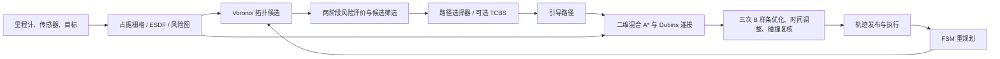

# TGH Planner 路径规划技术导读

> 面向新员工的代码与数学学习文档。以本仓库当前实现为准；公式中的“近似”“评分”与真正的硬约束会分别说明。建议先读第 1、2 节建立全局图景，再按第 12 节动手。

## 1. 系统要解决什么问题

移动机器人在局部、逐步感知的环境里规划时，同时面对四个问题：地图尚不完整；障碍物会使可行路径分成不同绕行类别；车辆不能横向平移或瞬间改变航向；给控制器的轨迹必须随时间连续且满足速度、加速度和安全距离要求。本项目把这些问题分层处理：地图负责描述环境，拓扑层寻找不同绕行方案，搜索层检查车辆能否到达，优化层产生平滑轨迹，状态机负责执行和重规划。

当前仿真入口是 [`kino_replan.launch`](src/TGH-Planner/TGH_Planner/plan_manage/launch/kino_replan.launch)，它加载 [`kino_algorithm.xml`](src/TGH-Planner/TGH_Planner/plan_manage/launch/kino_algorithm.xml) 与 [`risk_map.yaml`](src/TGH-Planner/TGH_Planner/plan_env/config/risk_map.yaml)。主链路可从 [`KinoReplanFSM::callKinodynamicReplan`](src/TGH-Planner/TGH_Planner/plan_manage/src/kino_replan_fsm.cpp)、[`FastPlannerManager::TopoPathReplan`](src/TGH-Planner/TGH_Planner/plan_manage/src/planner_manager.cpp)、[`FastPlannerManager::kinodynamicReplan`](src/TGH-Planner/TGH_Planner/plan_manage/src/planner_manager.cpp) 顺着看下去。

### 1.1 代码地图

| 问题 | 实现入口 | 产生或消费的数据 |
| --- | --- | --- |
| 占据栅格、二维距离场 | [`sdf_map.cpp`](src/TGH-Planner/TGH_Planner/plan_env/src/sdf_map.cpp) | 已知空闲、占据、未知；ESDF 距离 |
| 未知区、距离、走廊风险 | [`risk_map_manager.cpp`](src/TGH-Planner/TGH_Planner/plan_env/src/risk_map_manager.cpp) | 每格原始风险、可视化栅格 |
| 拓扑候选与等价路径剪枝 | [`topo_prm.cpp`](src/TGH-Planner/TGH_Planner/path_searching/src/topo_prm.cpp) | 多条离散路径、路径容器 |
| 粗细采样、CVaR、AVC | [`risk_aware_edge.cpp`](src/TGH-Planner/TGH_Planner/path_searching/src/risk_aware_edge.cpp) | 路径长度、风险、可行性与代价 |
| 最终引导路径评分 | [`risk_aware_path_selector.cpp`](src/TGH-Planner/TGH_Planner/path_searching/src/risk_aware_path_selector.cpp) | 选中路径、长度与风险评分 |
| 路径可靠性 PRS | [`PathReliabilityEvaluator.cpp`](src/TGH-Planner/TGH_Planner/path_searching/src/path_reliability/PathReliabilityEvaluator.cpp) | 风险、净空、风险波动 |
| 非完整约束搜索 | [`kinodynamic_astar_2D.cpp`](src/TGH-Planner/TGH_Planner/path_searching/src/kinodynamic_astar_2D.cpp) | 运动学可行的几何轨迹 |
| 连续轨迹优化 | [`bspline_optimizer.cpp`](src/TGH-Planner/TGH_Planner/bspline_opt/src/bspline_optimizer.cpp) | B 样条控制点与轨迹 |
| 执行和重规划 | [`kino_replan_fsm.cpp`](src/TGH-Planner/TGH_Planner/plan_manage/src/kino_replan_fsm.cpp) | 规划触发、状态转换 |

**坐标与单位。** 车辆运动与拓扑风险主要在二维平面 $(x,y)$ 上计算，距离单位为米，时间单位为秒，航向与转向角使用弧度参与运算。某些路径点以 `Eigen::Vector3d` 存储，但第三维在不同调用处可能是高度或临时存放的起点航向，阅读函数时应检查赋值位置，不能把所有 `z` 都理解为高度。

## 2. 地图：概率、距离与未知区域

### 2.1 占据概率为什么使用 log odds

设栅格被占据的概率为 $p$，log odds 定义为

$$\ell=\log\frac{p}{1-p},\qquad p=\frac{1}{1+e^{-\ell}}.$$

在常见独立观测近似下，每次射线命中或穿过栅格时，把一个增量加到旧值：

$$\ell_t=\operatorname{clip}\!\left(\ell_{t-1}+\log\frac{p_{\rm hit/miss}}{1-p_{\rm hit/miss}},\ell_{\min},\ell_{\max}\right).$$

加法更新比反复做贝叶斯概率乘除更方便；上下界防止概率饱和到无法恢复。代码中 [`SDFMap` 的参数读取与射线更新](src/TGH-Planner/TGH_Planner/plan_env/src/sdf_map.cpp)采用 `p_hit`、`p_miss`、`p_occ` 等参数。未观测单元有单独的未知标识；“未知”并不等于“已证实空闲”。启动文件中 `p_hit=0.8`、`p_miss=0.4`、`p_occ=0.60`，地图分辨率为 `0.1 m`。

### 2.2 ESDF 与安全距离

二维欧氏距离场可写作 $d(\mathbf{x})=\min_{\mathbf{o}\in\mathcal O}\|\mathbf{x}-\mathbf{o}\|_2$，其中 $\mathcal O$ 是已知占据区域。实际实现对栅格占据、膨胀、二维距离场做增量更新，并提供距离查询。距离越小，越靠近已知障碍物。路径搜索用 `getDistance2D(position) < obs_dis` 拒绝运动原语；轨迹发布前又沿最终 B 样条按 `0.02 s` 采样，拒绝净空小于 `0.15 m` 或非有限的轨迹点，见 [`kinodynamic_astar_2D.cpp`](src/TGH-Planner/TGH_Planner/path_searching/src/kinodynamic_astar_2D.cpp) 与 [`planner_manager.cpp`](src/TGH-Planner/TGH_Planner/plan_manage/src/planner_manager.cpp)。

这里的几何距离与风险是不同量。距离场提供障碍物净空；风险把净空、通道宽度和未知状态合并成偏好。风险阈值也不能代替最终轨迹碰撞检查。

### 2.3 风险图如何处理未知区

占据格风险为 $+\infty$。对于已知空闲格，代码近似计算

$$r_{\rm free}=\frac{\lambda_d}{\max(0,d)+\varepsilon}+\frac{\lambda_c}{\max(0,w-w_{\rm robot})+\varepsilon},$$

其中 $w$ 是走廊宽度，$w_{\rm robot}$ 是车辆宽度。走廊宽度用横向和纵向连续非占据格长度的较小者近似，**不是**严格的几何最大内接圆直径。对未知格，由于距离场可能尚为零，使用有界的假定净空：

$$\begin{aligned}
d_u&=\max(d,w_{\rm robot},h),\\
m_u&=\max(w_{\rm robot},h),\\
r_{\rm unknown}&=\lambda_u+\frac{\lambda_d}{d_u+\varepsilon}+\frac{\lambda_c}{m_u+\varepsilon},
\end{aligned}$$

$h$ 是地图分辨率。设计原因是：若未知格直接按零净空算，所有探索边界都会得到极大风险，机器人可能永远无法进入未知区；若把未知格视作完全空闲，又没有探索代价。这一选择允许探索，但对尚未看见的真实障碍**没有安全保证**。新员工应同时观察传感器更新、局部重规划与最终碰撞检查，而不能只看风险图。

[`/risk_map/risk_2D`](src/TGH-Planner/TGH_Planner/plan_env/src/risk_map_manager.cpp) 是经过 $100r/(1+r)$ 单调压缩的 `OccupancyGrid` 可视化值；规划计算使用原始 `double` 风险，不应把图像上的 0–100 与 `risk_safe_threshold` 直接比较。地图外查询返回 $+\infty$；风险图未就绪时，`RiskAwareEdge` 暂按零风险计算，因此启动阶段必须关注地图就绪状态。

## 3. 拓扑层：为什么先找多条路

障碍物两侧的路径，局部连续变形时往往无法互换。若只优化一条初始曲线，梯度法可能困在当前绕行方式里。拓扑层先生成不同候选，再让后续搜索和优化逐一检验。当前主入口 [`FastPlannerManager::TopoPathReplan`](src/TGH-Planner/TGH_Planner/plan_manage/src/planner_manager.cpp)调用 `findVoroPaths()`，随后由 `findGuidePath()` 选引导路径；传统 `findTopoPaths()` 调用在该处注释掉了。

Voronoi/广义 Voronoi 思路利用“与多个障碍物边界等距”的骨架提供较大净空的通道。代码从地图的 Voronoi 规划结果取得路径，再通过 [`TopologyPRM::pruneEquivalent`](src/TGH-Planner/TGH_Planner/path_searching/src/topo_prm.cpp)等步骤去重、裁剪和入路径容器。`sameTopoPath()` 会把两条路径离散到相近点数，检查对应点与中点间的可见线段，以此近似判断是否可在空闲空间中相互变形。这是工程化的**拓扑等价启发式**，采样和地图分辨率会影响判定；它不是形式化的同伦证明。

拓扑路径只回答“从哪一侧绕”；它不直接保证车辆转得过弯、速度连续或满足碰撞净空。下一层的混合 A* 与 B 样条负责这些问题。

## 4. 候选路径的两阶段评价

设一轮有 $M$ 条候选，路径 $p$ 长度为 $L_p$，粗采样间隔 $h_c$，细采样间隔 $h_f$，细评条数 $K=\min(M,\texttt{top\_k\_path})$。粗评对每段算二维长度、平均采样风险并检查超阈值风险，用

$$S_p^{\rm coarse}=\alpha\frac{L_p}{L_{\max}^{\rm coarse}+\varepsilon}+\beta\frac{R_p^{\rm coarse}}{R_{\max}^{\rm coarse}+\varepsilon}$$

选出前 $K$ 条；细评重新采样这 $K$ 条，计算 CVaR、最大风险和 AVC。粗评不会计算 AVC，因此 Top-K 是速度与完整性之间的折中：真正好但粗评分偏高的路径可能被漏掉。粗采样同样会错过采样点之间的小障碍；后续搜索和轨迹检查仍是必要的。

忽略固定开销，风险采样量由约 $O(M\bar L/h_f)$ 下降为 $O(M\bar L/h_c+K\bar L/h_f)$；细评风险样本还要逐边排序。代码用 `partial_sort` 找 Top-K，并用线程局部 `vector<double>` 复用风险采样缓冲区。默认 `coarse_resolution=1.0 m`、`fine_resolution=0.1 m`、`top_k_path=10`。如果有效候选少于 $K$，全部进入细评。数量与耗时在 `RiskAwareEdge two-stage` 日志里输出，见 [`evaluateCandidatePaths()`](src/TGH-Planner/TGH_Planner/path_searching/src/risk_aware_edge.cpp)。

> **边界条件：** `evaluatePath()` 可以单独调用，但只知道一条路径，因此只产生原始指标；同轮候选归一化必须由 `normalizeCandidateCosts()` 完成。

## 5. 风险：均值、尾部风险与硬约束

对一条边均匀采样 $N$ 个风险值 $r_1,\ldots,r_N$，包含两端点。平均风险、最大风险分别是

$$R_{\rm avg}=\frac1N\sum_{i=1}^{N}r_i,\qquad R_{\max}=\max_i r_i.$$

若一小段危险区域被大量安全采样点稀释，$R_{\rm avg}$ 仍可很低。代码把样本降序排序，取最高的 $n=\max(1,\lceil qN\rceil)$ 个样本：

$$\operatorname{CVaR}_{1-q}^{\rm empirical}=\frac1n\sum_{i=1}^{n}r_{(i)},\qquad
R_{\rm edge}=R_{\rm avg}+\lambda_{\rm CVaR}\operatorname{CVaR}_{1-q}^{\rm empirical}.$$

默认 $q=0.1$、$\lambda_{\rm CVaR}=1$。这里“CVaR”指等间隔离散样本的最高 10% 均值，是经验尾部平均；不是对整个连续路径风险分布做精确积分。整条路径风险取**各边风险的算术平均** $R_p=\frac1E\sum_{e=1}^E R_e$，因此短边与长边权重相同；改变路径离散方式可能改变结果。

边上只要出现非有限值，或 $R_{\max}>\min(T_{\rm risk},T_{\rm safe})$，细评立即把它标记为不可行；粗评也按这两个阈值拒绝样本。默认 `risk_threshold=1e100` 基本不生效，`risk_safe_threshold=150` 是当前 YAML 的主约束。阈值对原始风险起作用，**不是**对压缩后的风险图颜色，也不是对已加 CVaR 的平均风险。路径搜索和最终轨迹仍需各自检查碰撞。

## 6. AVC：离散非完整运动惩罚

对连续三点 $P_{i-1},P_i,P_{i+1}$，令 $a=P_i-P_{i-1}$、$b=P_{i+1}-P_i$，只取 $x,y$。任一段长度小于 $10^{-6}$ 时惩罚为零；否则用单位向量的点积与二维叉积求转角：

$$\Delta\theta=\left|\operatorname{atan2}(\hat a_x\hat b_y-\hat a_y\hat b_x,\hat a\cdot\hat b)\right|\in[0,\pi].$$

以后一段长 $d_s=\|b\|$ 和名义速度 $v_n$ 估计 $\Delta t=d_s/v_n$；最小转弯半径 $R_{\min}$ 对应 $\omega_{\max}=v_n/R_{\min}$。定义

$$\rho=\frac{|\Delta\theta/\Delta t|}{\omega_{\max}+10^{-6}},\qquad
C_{\rm AVC}=\max(0,\rho-1)^2.$$

它是无量纲的“离散路径难转弯”评分：只惩罚超出近似角速度上限的转角。忽略数值稳定项，$\rho\approx\Delta\theta R_{\min}/d_s$，名义速度几乎抵消；因此该评分主要由转角、段长和最小转弯半径决定，**不是**完整的时间参数化车辆可行性证明。第一段没有前一点，AVC 为零；路径 AVC 是各边 AVC 的平均值。该评价不替代 B 样条优化或混合 A* 的运动约束。

## 7. 候选评分与最终选路是两个步骤

### 7.1 `RiskAwareEdge` 的候选集合归一化

在通过细评和风险硬约束的候选集合 $\mathcal C$ 内，取 $L_{\max}=\max_{p\in\mathcal C}L_p$、$R_{\max}^{\rm path}=\max_{p\in\mathcal C}R_p$，代码计算

$$J_p^{\rm edge}=\alpha\frac{L_p}{L_{\max}+\varepsilon}+\beta\frac{R_p}{R_{\max}^{\rm path}+\varepsilon}+\gamma C_{{\rm AVC},p}.$$

若某项最大值为零，分母中的 $\varepsilon$ 防止除零。注意只有**长度和风险**用同轮最大值归一化；AVC 已按无量纲量原样加入。集合一变，分母就会变，所以 $J^{\rm edge}$ 适合同轮相对比较，不适合跨轮当作物理绝对风险。旧的 `curvature_cost` 字段仍保留为兼容别名。调试日志分别打印原始指标、归一化指标和最终代价。

### 7.2 当前主流程实际采用的最终效用

[`TopologyPRM::findGuidePath()`](src/TGH-Planner/TGH_Planner/path_searching/src/topo_prm.cpp)构造当前路径容器中的候选，调用 [`RiskAwarePathSelector::selectBestPath()`](src/TGH-Planner/TGH_Planner/path_searching/src/risk_aware_path_selector.cpp)。它用**候选集合最小值和最大值**，而非上一节的“除最大值”，构造

$$s_L(p)=1-\frac{L_p-L_{\min}}{L_{\max}-L_{\min}},\qquad
s_R(p)=\frac{R_p-R_{\min}}{R_{\max}-R_{\min}}.$$

分母接近零时，代码把该指标的归一化值设为零：所有长度相同则 $s_L=1$，所有风险相同则 $s_R=0$。它**最大化**效用：

$$U_p=\begin{cases}
\lambda_L s_L(p)-\lambda_R s_R(p)+\lambda_P\operatorname{PRS}(p), & \text{PRS 开启},\\
w_1^{\rm dyn}s_L(p)-w_2^{\rm dyn}s_R(p), & \text{PRS 关闭}.
\end{cases}$$

PRS 开启时，默认权重为 $(\lambda_L,\lambda_R,\lambda_P)=(2,1,0.5)$；关闭时 `w1=1`、`w2=1.5`，并按平均走廊宽度、平均风险上调相应权重。评分非常接近时，初始航向误差较小的路径优先。**不要把 $J_p^{\rm edge}$ 与 $U_p$ 当成同一公式。** AVC 在风险评价层计算并参与其内部排序，但当前 `selectBestPath()` 的效用式没有单独 AVC 项。

### 7.3 PRS 的数学含义

[`PathReliabilityEvaluator`](src/TGH-Planner/TGH_Planner/path_searching/src/path_reliability/PathReliabilityEvaluator.cpp)按路径弧长采样。设风险均值 $\bar r$、净空 $d_i$、风险总体方差 $\sigma_r^2=N^{-1}\sum_i(r_i-\bar r)^2$，则

$$C_{\rm clearance}=\frac1N\sum_i\frac1{\max(0,d_i)+\varepsilon},\qquad
\operatorname{PRS}=\exp(-a\bar r-bC_{\rm clearance}-c\sigma_r^2).$$

PRS 越接近 1 越偏好；波动项能区分同均值但包含高风险斑块的路径。它是确定性启发式分数，不应解释为“该路径有 PRS 概率安全”。默认 YAML 开启 PRS，参数 $a=0.14,b=0.69,c=0.17$。前面的 CVaR 按**每条边**计算，而 PRS 按**整条路径等弧长**采样，统计对象并不相同。

### 7.4 拓扑稳定性目前怎样工作

路径选择器提供 `selectStablePath()`、`switch_threshold=0.1` 与 `lambda_switch=0.1` 接口。若使用该接口，异拓扑候选先承担 $\lambda_{\rm switch}$，切换收益按

$$J'_p=J_p+\lambda_{\rm switch}\mathbf 1[\operatorname{topo}(p)\ne\operatorname{topo}_{\rm current}],\qquad
G=\frac{J_{\rm current}-J'_{\rm challenger}}{J_{\rm current}+\varepsilon}$$

计算，只有 $G>\texttt{switch_threshold}$ 才切换，当前拓扑无有效路径时可强制切换。但当前 `findGuidePath()` **没有调用**它，也没有向 `selectBestPath()` 提供用于该函数的拓扑 ID。因此不能把这组参数描述成默认主链路正在执行的切换约束。

另一个**可选**机制是 TCBS，默认 `enable_tcbs=false`。开启时，路径效率损失 $E=\operatorname{clip}(1-D/L,0,1)$（$D$ 为起终点直线距离），风险评分 $R=\operatorname{clip}(R_p/T_{\rm high},0,1)$，瓶颈分数 $B=\max(E,R)$；在可行的当前拓扑 Keep 与 Challenger 间，仅当 $B_{\rm challenger}<(1-\eta)B_{\rm keep}$ 时切换。当前拓扑失效时可强制切换。`eta_switch` 默认 `0.15`，启动参数可覆盖。最终优化轨迹通过 `tryCommitGuidePath()` 验证后才提交，避免只根据提议路径更新当前拓扑。参考 [`findGuidePath()` 与 `tryCommitGuidePath()`](src/TGH-Planner/TGH_Planner/path_searching/src/topo_prm.cpp)。

## 8. 混合 A*：把车辆可行性放进搜索

普通栅格 A* 的状态仅有 $(x,y)$，同一个格子里的不同朝向被视为相同。汽车无法原地横移，因此二维搜索状态还包括航向 $\theta$ 与速度 $v$。代码使用运动学自行车模型的一阶欧拉积分：

$$\dot x=v\cos\theta,\quad \dot y=v\sin\theta,\quad
\dot\theta=\frac{v\tan\delta}{L_{\rm wheelbase}},\qquad
\mathbf s_{t+\tau}\approx\mathbf s_t+\tau\dot{\mathbf s}_t.$$

$\delta$ 为离散转向角。由于 $|\delta|\le\delta_{\max}$，最小转弯半径近似 $R_{\min}=L_{\rm wheelbase}/\tan\delta_{\max}$。该半径属于搜索车辆模型；第 6 节 `risk_aware_graph/min_turn_radius` 是独立的评价参数，配置不一致时 AVC 只能算软提示。

每条运动原语沿时间采样，若与障碍净空不足则拒绝。`g` 主要基于速度乘持续时间，并对转向及转向级别变化乘惩罚；目前倒车分支留作 TODO，启动配置 `reverse_enable=false`。优先队列使用

$$f(n)=g(n)+\lambda_h h(n).$$

默认二维 `lambda_heu=1.05`。无引导路径时，启发函数远处用欧氏距离，目标附近用 Dubins 路径长度考虑位置与航向；有引导路径时，用 KD-tree 找最近引导点，取剩余引导长度加横向偏离惩罚。后者会改变节点扩展顺序，但**不会强制搜索结果逐点贴合引导路径**。这一启发项和加权系数不应直接宣称满足最优 A* 的可采纳条件。靠近终点时尝试 Dubins 连接并逐点碰撞检测；也可能在局部搜索视界到达时返回一段局部路径。见 [`estimateHeuristic()`、`stateTransit()`、`computeShotTraj()`](src/TGH-Planner/TGH_Planner/path_searching/src/kinodynamic_astar_2D.cpp)。

如果看到 `Can't find path!! in retry.`，含义是两次混合 A* 搜索都返回 `NO_PATH`；它不是风险图单独报错。应按“里程计与起终点 → 地图就绪与坐标系 → 候选引导路径 → 运动原语碰撞净空 → 搜索节点上限/视界”顺序排查。第一次与重试分别使用连续、非连续初始状态。

## 9. B 样条：把离散路径变成可执行轨迹

三次 B 样条可写成

$$\mathbf p(t)=\sum_i N_{i,3}(t)\mathbf Q_i,$$

其中 $\mathbf Q_i$ 是控制点，$N_{i,3}$ 是次数为 3 的局部基函数。基函数由节点向量 $\{u_i\}$ 的 Cox–de Boor 递推得到：$N_{i,0}(t)=1$ 当 $u_i\le t<u_{i+1}$，其余为零；对 $k>0$，

$$N_{i,k}(t)=\frac{t-u_i}{u_{i+k}-u_i}N_{i,k-1}(t)+\frac{u_{i+k+1}-t}{u_{i+k+1}-u_{i+1}}N_{i+1,k-1}(t),$$

分母为零的项按零处理。局部支撑意味着修改一个控制点只影响邻近曲线段，有利于局部优化。在有效节点区间，非负基函数求和为一，因此曲线落在相关控制点的凸包内。对均匀节点间隔 $\Delta t$，一阶、二阶有限差分近似速度和加速度，三阶差分近似 jerk：

$$\Delta\mathbf Q_i=\mathbf Q_{i+1}-\mathbf Q_i,\quad
\Delta^2\mathbf Q_i=\mathbf Q_{i+2}-2\mathbf Q_{i+1}+\mathbf Q_i,\quad
\Delta^3\mathbf Q_i=\mathbf Q_{i+3}-3\mathbf Q_{i+2}+3\mathbf Q_{i+1}-\mathbf Q_i.$$

经理模块将混合 A* 路径采样并拟合为三次 B 样条，再按阶段优化控制点。`NORMAL_PHASE` 包含平滑、障碍距离和可行性三类代价；当前平滑项直接求 $\sum_i\|\Delta^3\mathbf Q_i\|^2$。距离项在控制点靠近障碍阈值时施加惩罚；可行性项对差分速度/加速度超限施加平方惩罚。这些是**软代价**，不等于连续时间严格约束。其他阶段还可加入拓扑引导、感知和控制点航向相关代价，见 [`BsplineOptimizer::combineCost()`](src/TGH-Planner/TGH_Planner/bspline_opt/src/bspline_optimizer.cpp)。

时间拉伸也有直接的数学解释：若保持曲线形状，把执行时间放大 $s>1$，则 $\dot{\mathbf p}$ 按 $1/s$ 缩小，$\ddot{\mathbf p}$ 按 $1/s^2$ 缩小。优化后，`checkFeasibility()` 检查速度与加速度；不满足时至多 30 轮 `reallocateTime()` 拉长时间，仍不满足则拒绝。随后沿**最终**曲线采样检查有限值与障碍净空，并在 TCBS 模式下检查拓扑提交条件，合格后才更新/发布轨迹。总之，从离散路径到控制器命令经历“搜索可行 → 曲线拟合 → 软优化 → 动力学检查 → 碰撞复核”，每层约束的作用都不同。参见 [`planner_manager.cpp`](src/TGH-Planner/TGH_Planner/plan_manage/src/planner_manager.cpp) 与 [`non_uniform_bspline.cpp`](src/TGH-Planner/TGH_Planner/bspline/src/non_uniform_bspline.cpp)。

## 10. FSM 与闭环重规划

[`KinoReplanFSM`](src/TGH-Planner/TGH_Planner/plan_manage/src/kino_replan_fsm.cpp)使用 `INIT → WAIT_TARGET → GEN_NEW_TRAJ → EXEC_TRAJ` 的主流程；执行期间按时间与安全检查转入 `REPLAN_TRAJ`。二维模式重规划时读取实时里程计位置、速度和航向，并尝试沿现有轨迹取初始加速度。规划成功回到 `EXEC_TRAJ`，失败返回新轨迹生成路径。状态机并非连续轨迹优化器，它决定**何时**规划、何时继续执行，以及失败后走哪条恢复分支。

调试时需区分“规划失败”与“车没有跟上规划”：执行状态中的 `pos` 是轨迹按当前时间求得的期望位置，机器人即使未运动，这个期望点也会前进。只看轨迹位置不能判断真实车位，应同时检查里程计、控制器跟踪误差、地图和规划日志。

## 11. 参数与工程取舍速查

下表是**当前仓库配置**，不是普适推荐值；主配置来源见 [`risk_map.yaml`](src/TGH-Planner/TGH_Planner/plan_env/config/risk_map.yaml) 和 [`kino_algorithm.xml`](src/TGH-Planner/TGH_Planner/plan_manage/launch/kino_algorithm.xml)。

| 参数 | 当前值 | 理解与调节方向 |
| --- | ---: | --- |
| `risk_map/robot_width` | `0.5 m` | 风险走廊余量的参考宽度，不自动等于搜索碰撞车体尺寸 |
| `risk_map/lambda_unknown` | `0.5` | 未知区额外风险；增大时更保守 |
| `risk_aware_graph/alpha,beta,gamma` | `1.0, 0.40, 0.50` | 细评中长度、CVaR 风险、AVC 的相对权重 |
| `risk_aware_graph/coarse_resolution` | `1.0 m` | 越大越快，也越容易漏掉局部风险 |
| `risk_aware_graph/fine_resolution` | `0.1 m` | 边风险采样；与地图分辨率同量级 |
| `risk_aware_graph/top_k_path` | `10` | 增大可减少粗筛漏优风险，但会增加细评耗时 |
| `risk_aware_graph/risk_cvar_ratio,weight` | `0.1, 1.0` | 最高 10% 样本均值及其权重 |
| `risk_aware_graph/risk_safe_threshold` | `150` | 原始单点最大风险硬阈值；需结合原始风险分布校准 |
| `risk_aware_graph/min_turn_radius` | `1.0 m` | AVC 评分半径，与车辆搜索模型的半径分别配置 |
| `path_reliability/enable` | `true` | 最终选择器使用长度、风险、PRS 效用 |
| `risk_aware_path_selector/enable_tcbs` | `false` | 默认不启用 TCBS 切换滞回 |
| `search_2D/horizon,obs_dis` | `7.0 m`、启动参数 `clearance_all` | 搜索局部视界与运动原语净空阈值 |

**可比性与尺度。** 风险图原始值的量级取决于分辨率、宽度估计和 $\varepsilon$；先记录典型空旷区、窄通道、未知区、障碍边缘的原始风险，再设阈值。候选集合归一化会在每轮变化，因此不能用单轮评分直接比较不同场景。AVC、PRS 与风险约束来自不同统计对象，调参时最好每次只变一个机制。

**构建语言。** 本仓库相关 CMakeLists 当前设置 `-std=c++17`，见 [`path_searching/CMakeLists.txt`](src/TGH-Planner/TGH_Planner/path_searching/CMakeLists.txt) 与 [`plan_manage/CMakeLists.txt`](src/TGH-Planner/TGH_Planner/plan_manage/CMakeLists.txt)。ROS1 Noetic 可运行环境与“项目以 C++14 编译”不是同一个判断；修改代码时应以实际构建配置和编译结果为准。

## 12. 新员工学习路线与练习

1. **第 1 阶段：地图与坐标。** 读 `kino_replan.launch`、`kino_algorithm.xml`、`SDFMap`，画出传感器点云、里程计、`world` 地图帧到占据/ESDF 的数据流。用简单障碍物手算 log odds 的一次命中和漏检更新，并核对 `p_hit/p_miss`。
2. **第 2 阶段：拓扑与风险。** 读 `RiskMapManager`、`TopologyPRM::findVoroPaths()`、`sameTopoPath()`。画一个中央障碍、左右两条绕行路，解释为何单条曲线局部优化难以换边；对一条边的十个风险样本手算平均值、Top 10% CVaR、最大风险与阈值结果。
3. **第 3 阶段：候选选择。** 读 `RiskAwareEdge::evaluateCandidatePaths()`、`normalizeCandidateCosts()`、`RiskAwarePathSelector::selectBestPath()`。自造三条路径的数据，分别算粗筛分数、细评 $J^{\rm edge}$ 与最终 $U$；解释它们为什么可能选出不同路径。打开 `RiskAwareEdge two-stage`、`[RiskPathSelector]` 日志核对结果。
4. **第 4 阶段：车辆搜索与轨迹。** 手算一段自行车模型欧拉步进与最小转弯半径，随后读 `KinodynamicAstar2D::search()` 和 `computeShotTraj()`；再读 `BsplineOptimizer::combineCost()` 与 `FastPlannerManager::kinodynamicReplan()`，追踪一条搜索路径如何变成最终可发布样条。
5. **集成练习。** 在仿真中分别制造“未知区风险较高”“窄通道”“急转弯”“目标附近障碍”四种情况。记录候选数、粗细评价耗时、最大原始风险、PRS、A* 状态、B 样条可行性和 FSM 状态。只在明确失败层后改参数，保留原始日志作为比较基线。

### 快速排障观察点

| 现象 | 先查的证据 | 常见原因类别 |
| --- | --- | --- |
| 拓扑候选为空 | `path_size_by_voro`、`no_candidates`、占据/ESDF 地图 | 地图未更新、起终点/坐标系不一致、可见通道不足 |
| 候选在两阶段评价后骤减 | `coarse_count/fine_count/feasible_count`、`risk_max` | 阈值过低、地图外采样、占据格、粗筛漏选 |
| `Can't find path!! in retry.` | 起点占据、`obs_dis`、搜索节点数、引导路径 | 运动原语碰撞、车体转弯不可达、搜索预算或地图问题 |
| 搜索成功但未发布 | `B-spline remains dynamically infeasible`、`Reject final B-spline` | 速度/加速度约束或最终轨迹净空失败 |
| 频繁换边/反复重规划 | `enable_tcbs`、`[TCBS]`、`[RiskPathSelector]`、FSM 状态 | 候选集波动、控制跟踪误差、无默认拓扑滞回 |

## 13. 必须记住的几个区别

- **未知区有限风险**是探索策略，不是对未知障碍的安全证明。
- **风险最大值硬阈值**、**CVaR 软评分**、**ESDF 碰撞检查**是三个不同层次。
- **拓扑候选**、**车辆可行搜索结果**、**优化后可执行轨迹**不是同一条对象。
- **`RiskAwareEdge` 的最大值归一化代价**与**最终选择器的最小最大效用**不是同一公式。
- **`selectStablePath()` 已实现但未接入当前选路调用**；默认 TCBS 也关闭。讨论“拓扑稳定性生效”时应先核实开关和实际调用链。
- **路径风险按边平均**，AVC 也按边平均；改变路径离散密度可能影响分数。PRS 则按整条路径弧长采样。

以上各节的数学模型用于解释代码设计。评估真实运行效果时，应结合地图观测质量、离散采样间隔、车辆参数、控制器跟踪误差和实际日志，而不只根据某个单一代价函数推断成功率。
