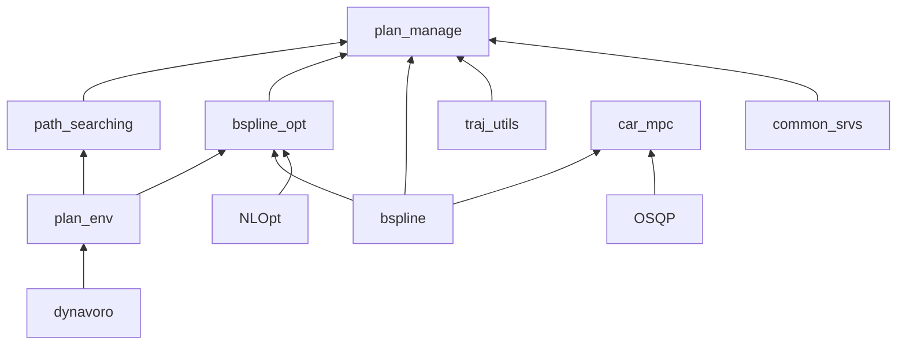
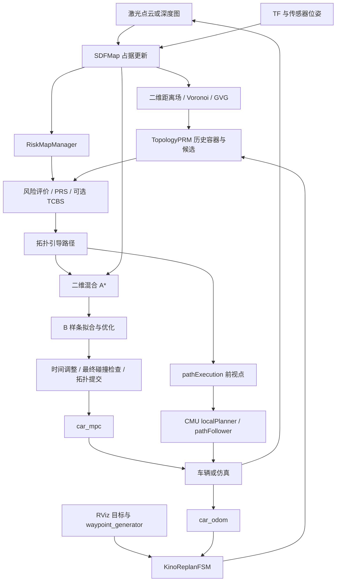
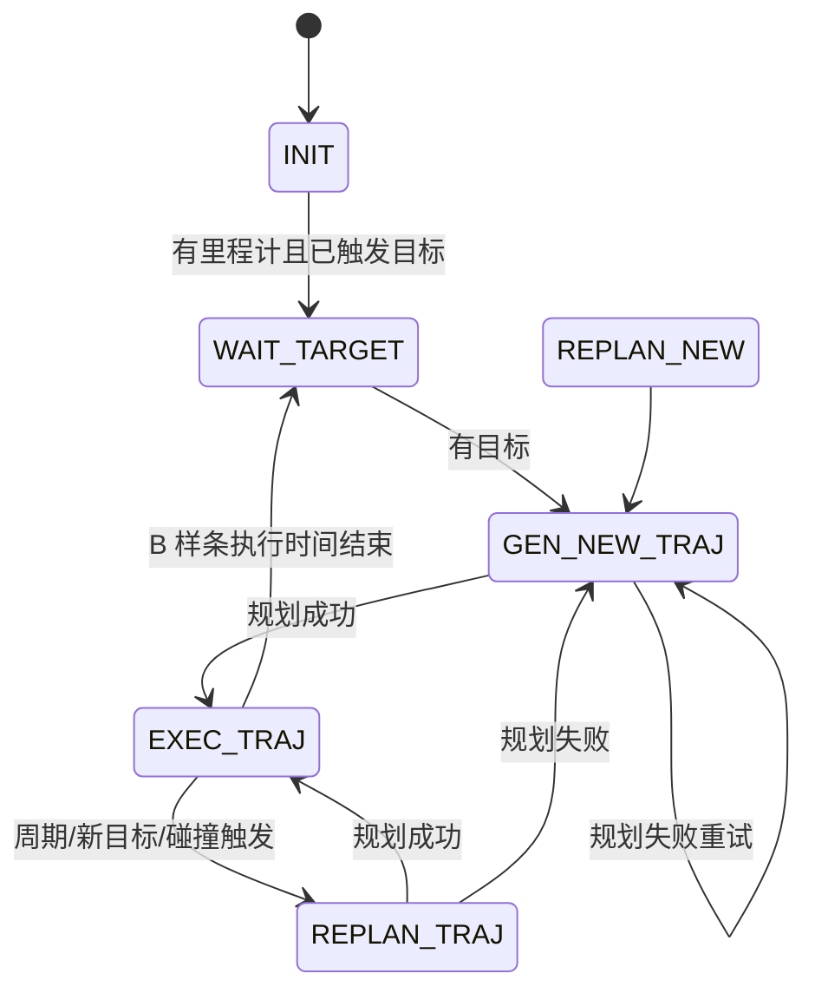

# mynav / TGH-Planner 项目技术导读

> 导读基准：2026-09-28，工作空间 `/home/hyh/mynav`，Git HEAD `0e9ac05`，并包含当前工作区已有修改。
>
> 本文依据本地源码、CMake、launch、参数文件和测试源码整理。它解释当前仓库的实际实现，不把 README 中的研究描述、注释中的设想或未启用分支当作已生效功能。本次工作仅编写文档，没有重新编译、运行测试或启动 Gazebo；文中的操作命令供后续复现使用。

## 阅读导航

本文按“工程入口 → 数据流 → 核心算法 → 执行闭环 → 配置与排障”的顺序展开。

1. [项目定位与能力边界](#1-项目定位与能力边界)
2. [目录、包与依赖关系](#2-目录包与依赖关系)
3. [启动入口与模式选择](#3-启动入口与模式选择)
4. [完整数据流与一次规划的调用链](#4-完整数据流与一次规划的调用链)
5. [坐标系、单位与数据结构约定](#5-坐标系单位与数据结构约定)
6. [地图层：SDFMap、占据更新与二维距离场](#6-地图层sdfmap占据更新与二维距离场)
7. [风险地图的计算与解释](#7-风险地图的计算与解释)
8. [DynamicVoronoi、GVG 与 EGVG](#8-dynamicvoronoigvg-与-egvg)
9. [增量拓扑图更新与回退机制](#9-增量拓扑图更新与回退机制)
10. [TopologyPRM 与历史路径容器](#10-topologyprm-与历史路径容器)
11. [两阶段路径评价、CVaR 与 AVC](#11-两阶段路径评价cvar-与-avc)
12. [PRS 与最终路径选择](#12-prs-与最终路径选择)
13. [TCBS 的提议、验收与提交](#13-tcbs-的提议验收与提交)
14. [二维混合 A* 与 Dubins 连接](#14-二维混合-a-与-dubins-连接)
15. [B 样条表示、拟合与多阶段优化](#15-b-样条表示拟合与多阶段优化)
16. [轨迹时间调整与最终验收](#16-轨迹时间调整与最终验收)
17. [FSM 与闭环重规划](#17-fsm-与闭环重规划)
18. [MPC、车辆仿真与控制指令](#18-mpc车辆仿真与控制指令)
19. [CMU 局部规划分支](#19-cmu-局部规划分支)
20. [ROS 接口速查](#20-ros-接口速查)
21. [参数分层与调参方法](#21-参数分层与调参方法)
22. [构建、启动、地图工具与记录](#22-构建启动地图工具与记录)
23. [测试、验证与实验设计](#23-测试验证与实验设计)
24. [常见故障与定位顺序](#24-常见故障与定位顺序)
25. [性能、实现边界与改进方向](#25-性能实现边界与改进方向)
26. [推荐源码阅读路线与术语表](#26-推荐源码阅读路线与术语表)

## 1. 项目定位与能力边界

### 1.1 项目解决的问题

本项目是一个 ROS1 Catkin 工作空间，核心代码位于 `src/TGH-Planner`。它面向具有非完整运动约束的地面车辆：车辆主要沿车头方向运动，无法像二维质点一样随意横向移动；同时，机器人通过传感器逐步认识环境，规划开始时可能不知道完整障碍分布。

一个成功的导航过程需要依次解决以下问题：

| 层次 | 需要回答的问题 | 核心输出 |
| --- | --- | --- |
| 感知与地图 | 哪些地方已经观测，哪里有障碍，离障碍多远？ | 占据栅格、二维距离场 |
| 环境风险 | 未知区域、窄通道和低净空区域有多不利？ | 原始风险栅格 |
| 全局拓扑 | 从障碍左侧还是右侧绕行，有哪些不同通道？ | 多条拓扑候选路径 |
| 候选评价 | 哪条路径在长度、风险、转弯难度上更合适？ | 引导路径 |
| 车辆搜索 | 车辆以当前朝向能否沿这一方向继续前进？ | 运动学搜索路径 |
| 连续轨迹 | 如何让路径平滑，并分配可执行的时间？ | 位置、速度、加速度与航向轨迹 |
| 控制执行 | 如何根据实际位姿跟踪参考轨迹？ | 加速度、转向角或线/角速度 |
| 在线重规划 | 新障碍出现或车辆偏离后如何恢复？ | 新一轮规划与控制闭环 |

### 1.2 TGH、EGVG 与仓库的关系

本地 README 把项目描述为 TGH 与 EGVG 的组合：TGH 负责拓扑引导下的分层规划，EGVG 提供改进的 Voronoi 图及多拓扑路线。工程还继承了 FAST-Planner 的管理器、FSM、B 样条等组织方式，因此代码中仍有 `fast_planner` 命名空间、`flight_type`、`drone` 等历史名称。

阅读这些名称时，应以实际创建的类和当前启动参数判断用途。例如当前管理器创建的是 `KinodynamicAstar2D`，即使调用者保留了 `kinodynamic` 或部分飞行器注释，也不能直接按原始三维无人机算法理解。

### 1.3 当前不是单一流水线

系统存在两条主要运行路线：

- **TGH B 样条路线**：地图 → EGVG/拓扑路径 → 风险选路 → 二维混合 A* → B 样条优化 → MPC → 车辆。
- **EGVG + CMU 路线**：地图 → EGVG/拓扑路径 → 风险选路 → 前视目标点 → CMU 局部路径库 → 路径跟踪 → `/cmd_vel`。

两条路线共享全局引导层，但局部规划、轨迹验证和控制器不同。比较实验时不能只记录“使用同一个 launch”，还必须记录 `B_Spline_LocalPlanner`、`sim_pose`、`Diff_Model` 等参数。

### 1.4 阅读本文时要保留的边界

当前默认配置是二维、静态环境规划：`manager/only2D=true`、`manager/dynamic_environment=0`。仓库包含动态物体预测、三维搜索、其他 FSM 和飞行器仿真代码，但这些代码的存在不代表当前默认运行中使用了它们。

“未知环境导航”表示机器人朝给定目标行驶时在线发现地图。虽然增量图管理器有 frontier 数据结构，也不能由此推断系统已经实现“主动选择探索目标并覆盖全图”的完整自主探索任务系统。

## 2. 目录、包与依赖关系

### 2.1 工作空间目录

```text
mynav/
├── build_tgh.sh                    # 当前工作空间构建入口
├── 3rd/                            # NLopt、OSQP、OsqpEigen 源码/压缩包
├── src/
│   └── TGH-Planner/
│       ├── TGH_Planner/             # 核心地图、搜索、优化、规划管理
│       ├── dynamicvoronoi/          # ROS 包名为 dynavoro
│       ├── car_simulator/           # 控制器、车辆消息、运动学仿真
│       ├── cmu_palnner/             # 原目录拼写如此；CMU 局部规划链
│       ├── gazebo_sim/              # Gazebo、Jackal、传感器和其他仿真资源
│       ├── Utils/                   # 地图、路点、记录、离线实验工具
│       └── README.md
├── build/                          # CMake/Catkin 生成内容
├── devel/                          # 编译后的库、节点、环境脚本
├── logs/                           # 构建日志等
├── good_work.md                    # 已有算法导读，可作补充材料
├── 混合A星算法代码解析.md             # 已有专题说明
├── 安装指南.md                      # 已有操作笔记，含其他工作空间旧路径
└── mycar.md                        # 本文
```

`build/`、`devel/` 中的文件不能作为源代码修改入口。已有二进制和测试结果只能证明曾经产生过构建产物，不能单凭它们证明当前工作区源码已经通过构建。

### 2.2 核心 ROS 包

| 包名 | 所在目录 | 主要类/文件 | 职责 |
| --- | --- | --- | --- |
| `plan_manage` | `TGH_Planner/plan_manage` | `KinoReplanFSM`、`FastPlannerManager` | 协调规划、状态管理、发布样条 |
| `plan_env` | `TGH_Planner/plan_env` | `SDFMap`、`EDTEnvironment`、`RiskMapManager` | 地图、距离查询、风险查询 |
| `dynavoro` | `dynamicvoronoi` | `DynamicVoronoi`、`VoronoiLayer`、`GVG` | 距离/Voronoi 更新、图维护和路线搜索 |
| `path_searching` | `TGH_Planner/path_searching` | `TopologyPRM`、`KinodynamicAstar2D` | 拓扑路径管理、风险选路、车辆搜索 |
| `bspline` | `TGH_Planner/bspline` | `NonUniformBspline` | 样条求值、求导、拟合、时间调整 |
| `bspline_opt` | `TGH_Planner/bspline_opt` | `BsplineOptimizer` | 控制点优化和梯度计算 |
| `traj_utils` | `TGH_Planner/traj_utils` | `PlanningVisualization` | 发布调试轨迹与 Marker |
| `poly_traj` | `TGH_Planner/poly_traj` | 多项式轨迹实现 | 其他规划路径中的轨迹工具 |
| `common_srvs` | `TGH_Planner/common_srvs` | `.srv` 文件 | 位姿、环境重置、记录等服务类型 |
| `car_mpc` | `car_simulator/car_mpc` | `CarMpc`、控制 Nodelet | 参考样条跟踪与 QP 求解 |
| `car_simulator` | `car_simulator/car_simulator` | 仿真 Nodelet | 积分状态、发布里程计、同步仿真模型 |
| `car_msgs` | `car_simulator/car_msgs` | `CarCmd.msg` | 加速度与转角消息 |
| `local_planner` | `cmu_palnner/local_planner` | `localPlanner`、`pathFollower`、`pathExecution` | CMU 局部规划与跟踪 |
| `terrain_analysis` | `cmu_palnner/terrain_analysis` | 地形分析节点 | 给 CMU 局部规划提供地形数据 |
| `sensor_conversion` | `cmu_palnner/sensor_conversion` | `slam_sim_output_node` | 仿真传感器与状态数据适配 |

### 2.3 逻辑依赖图

以下展示主功能依赖，不是完整的 `package.xml` 展开：



算法层多数在一个 `fast_planner_node` 进程内，通过 C++ 对象调用共享地图，不是每个算法都独立运行一个 ROS 节点。ROS 话题主要连接传感器、规划器、控制器、仿真和可视化。

### 2.4 外部依赖分工

- **Eigen**：向量、矩阵、线性方程和稀疏矩阵运算。
- **PCL**：点云处理及引导路径最近点 KD-tree 查询。
- **OpenCV / cv_bridge**：图像、深度图、地图图像转换。
- **NLopt**：B 样条非线性优化。
- **OSQP**：车辆 MPC 的二次规划求解。
- **Gazebo / TF / nodelet / RViz**：仿真、坐标变换、运行组件和可视化。

`3rd` 中虽然有 OsqpEigen，但当前 `car_mpc` 使用 `iosqp.hpp` 封装和 `osqp::osqp` 链接目标。不要因目录中存在 OsqpEigen 就把它写成当前 MPC 唯一或必经的接口层。

## 3. 启动入口与模式选择

### 3.1 三个最重要的配置文件

1. [`kino_replan.launch`](src/TGH-Planner/TGH_Planner/plan_manage/launch/kino_replan.launch)：选择模式、场景、传感器、里程计，启动规划器和控制链。
2. [`kino_algorithm.xml`](src/TGH-Planner/TGH_Planner/plan_manage/launch/kino_algorithm.xml)：地图、搜索、拓扑、优化、FSM 参数。
3. [`risk_map.yaml`](src/TGH-Planner/TGH_Planner/plan_env/config/risk_map.yaml)：风险图、边评价、最终选路、PRS、TCBS 参数。

主节点使用私有句柄 `ros::NodeHandle nh("~")`。因此 `risk_map/risk_enable` 等参数通常位于 `/fast_planner_node/risk_map/risk_enable`，不是根命名空间的 `/risk_map/risk_enable`。

### 3.2 当前 launch 默认值

| 参数 | 当前默认值 | 实际影响 |
| --- | --- | --- |
| `B_Spline_LocalPlanner` | `false` | 默认进入 CMU 局部规划分支 |
| `sim_pose` | `false` | 默认由 Gazebo 状态链提供车辆位姿 |
| `Diff_Model` | `false` | 影响控制/运动学仿真分支，不等于切换一个完整差速 MPC |
| `start_rviz` | `true` | 启动相应 RViz 配置 |
| `enable_tcbs` | `false` | 默认不启用 TCBS 瓶颈切换逻辑 |
| `eta_switch` | `0.15` | TCBS 切换改善比例 |
| `init_x, init_y, init_phi` | `-45, 0, 0` | 运动学位姿模式初始状态相关参数 |
| Gazebo 平移偏置 | `50, 50` | 对齐 Gazebo 与规划世界坐标 |
| 地图范围 | `120 × 120 × 2.5 m` | 地图数组分配范围 |
| 最大速度/加速度 | `1.9 m/s`、`1.5 m/s²` | 向规划与控制传递上限 |
| 轴距/最大转角 | `0.5 m`、`45°` | 自行车模型相关配置 |
| 感知类型 | `2` | 点云输入；类型 `1` 是深度图分支 |
| `/use_sim_time` | `false` | ROS 时间当前按墙钟推进 |

`init_x` 在两种 `sim_pose` 模式下不能混为一谈：`sim_pose=true` 时运动学仿真器直接使用初始状态；`sim_pose=false` 时机器人实际 Gazebo 出生位置和位姿转换偏置共同决定规划器看到的位置。

### 3.3 默认节点入口

[`fast_planner_node.cpp`](src/TGH-Planner/TGH_Planner/plan_manage/src/fast_planner_node.cpp) 的关键逻辑是：

```text
读取 planner_node/planner
  = 1 → KinoReplanFSM::init()
  = 2 → TopoReplanFSM::init()
最后 ros::spin()
```

当前 XML 设置 `planner_node/planner=1`。因此主线应该阅读 `kino_replan_fsm.cpp`，而不是根据 `topo` 字样先进入 `topo_replan_fsm.cpp`。当前 Kino FSM 本身已经调用拓扑引导规划。

### 3.4 两种典型运行组合

```bash
# B 样条 + MPC + 运动学积分位姿
roslaunch plan_manage kino_replan.launch B_Spline_LocalPlanner:=true sim_pose:=true

# EGVG 引导 + CMU 局部规划 + Gazebo 状态
roslaunch plan_manage kino_replan.launch B_Spline_LocalPlanner:=false sim_pose:=false
```

`sim_pose=true` 不意味着完全不启动 Gazebo。`simulator.xml` 仍然包含 Gazebo 场景；区别是车辆位姿由独立积分器生成并与模型同步，环境和传感器仍可来自 Gazebo。

## 4. 完整数据流与一次规划的调用链

### 4.1 系统数据流



图中 B 样条和 CMU 是可选分支，不应理解为同一辆车正常运行时同时使用两个控制器竞争发布命令。

### 4.2 初始化过程

`KinoReplanFSM::init()` 首先检查模块组合是否合法：拓扑模块必须启用；若启用 B 样条模式，还要求运动学搜索和优化模块启用。错误组合会记录 `ROS_FATAL` 并抛异常。

随后 `FastPlannerManager::initPlanModules()`：

1. 读取车辆约束、控制点间距、二维模式和记录路径。
2. 创建 `SDFMap` 并初始化订阅、缓存和地图工具。
3. 创建 `EDTEnvironment` 并接入地图。
4. 根据开关创建几何 A*、二维混合 A*、10 个 B 样条优化器实例及 `TopologyPRM`。
5. 动态环境开关启用时才创建 `ObjPredictor`。

10 个优化器实例不等于默认并行优化 10 条轨迹。当前 B 样条链会按阶段使用不同索引，实际是否并行要看调用代码。

### 4.3 一次 B 样条规划

```text
KinoReplanFSM::callKinodynamicReplan()
  ├─ FastPlannerManager::TopoPathReplan()
  │    ├─ TopologyPRM::findVoroPaths()
  │    │    ├─ preprocess()：维护历史路径
  │    │    ├─ SDFMap::voro_plan()：图上寻路
  │    │    ├─ pruneEquivalent()：近似等价剪枝
  │    │    └─ selectShortPathsV2()：候选评价与容器管理
  │    └─ TopologyPRM::findGuidePath()
  ├─ FastPlannerManager::kinodynamicReplan()
  │    ├─ KinodynamicAstar2D::search()
  │    ├─ 必要时重试 search(..., false)
  │    ├─ getKinoTraj() 与搜索结果检查
  │    ├─ parameterizeToBspline()
  │    ├─ 多阶段 BsplineOptimizeTraj()
  │    ├─ checkFeasibility() / reallocateTime()
  │    ├─ 最终轨迹有限值与碰撞检查
  │    └─ tryCommitGuidePath()
  ├─ TCBS 候选失败时尝试下一候选
  ├─ planYaw()
  └─ 发布 /planning/bspline
```

### 4.4 一次 CMU 规划

同一个 `callKinodynamicReplan()` 在 `use_kino_replan_=false` 时，完成拓扑规划、可视化和引导路径提交后即返回，不运行 `kinodynamicReplan()`、B 样条优化或 MPC。

随后独立节点从 `/TopoPlan/guide_path` 生成前视点，CMU 局部规划器依据地形和局部障碍选出短路径，路径跟踪器输出 `/cmd_vel`。

这也是排障的重要分界：CMU 模式下没有 `/planning/bspline` 新消息，并不能直接判定“规划器坏了”。

## 5. 坐标系、单位与数据结构约定

### 5.1 主要坐标系

| 名称 | 用途 |
| --- | --- |
| `world` | 当前规划、地图和多数可视化使用的全局坐标系 |
| `map` | 启动文件通过静态 TF 与 `world` 对齐 |
| `base_link` | 车辆基座坐标系 |
| `jackal/velodyne/VLP_16` | 当前激光雷达坐标系 |
| `d435_link` / `d435_depth_optical_frame` | 深度相机备用输入链相关坐标系 |

TF 的职责是把某一时间的传感器测量变换到地图坐标系。地图空白、障碍与车体错位、位置跳变，首先检查消息 `frame_id`、时间戳和 TF 连通性，而不是直接调规划权重。

### 5.2 Gazebo 偏移的含义

当前场景使用 `(50,50)` 平移偏置。运动学仿真模式中，规划坐标加偏置后对应 Gazebo 坐标；例如规划位置 `(-45,0)` 对应 Gazebo 平面位置约 `(5,50)`。

反过来，Gazebo 状态转换到规划坐标时需要扣除对应偏置。应对照 `sensor_conversion` 和仿真器代码检查两端是否一致，避免在 TF 和点云处理代码中重复补偿。

### 5.3 地图世界坐标与栅格坐标

给定分辨率 `h` 和地图原点 `(ox,oy)`，典型查询使用：

\[
i_x=\left\lfloor\frac{x-o_x}{h}\right\rfloor,\quad
i_y=\left\lfloor\frac{y-o_y}{h}\right\rfloor.
\]

查询栅格中心则对应 `(ox+(ix+0.5)h, oy+(iy+0.5)h)`。ROS `OccupancyGrid`、内部三维数组、Voronoi 内部结构的地址映射不应凭印象互换；对接时检查各自的 `toAddress` 等函数。

当前 PNG 演示地图 `map.yaml` 使用 `resolution=0.1`、`origin=[-60,-60,0]`，与 `120 m × 120 m` 场景对应。地图图片像素坐标的上下方向还会经过地图加载转换，不能把图像行号直接当世界 y 坐标。

### 5.4 同样是 Vector3d，含义可能不同

- 普通路径点：通常是 `(x,y,z)`。
- `TopoPathReplan()` 传给 `findGuidePath()` 的起点：第三维暂时保存航向，用于候选初始方向评价。
- 航向状态 `start_yaw_`：保存航向及其导数相关分量，不是空间位置。
- 二维搜索节点：使用 6 维存储结构，但前四维主要是 `(x,y,theta,v)`；不能把存储维度直接理解为六个独立车辆自由度。

### 5.5 单位与角度转换

距离通常为米，时间为秒，速度为米/秒。launch 中最大转角是度，运动模型内部使用弧度，代码有 `/57.3` 等转换。修改配置或接入实车时，应沿“参数读取 → 内部变量 → 消息发布”逐步确认单位。

尤其是 `CarCmd.delta` 对应模型计算中的转角，不能把 launch 中的 `45.0` 原样视为消息单位。`Twist.angular.z` 则是角速度，与转角不是同一量。

## 6. 地图层：SDFMap、占据更新与二维距离场

主要入口：[sdf_map.cpp](src/TGH-Planner/TGH_Planner/plan_env/src/sdf_map.cpp)、[sdf_map.h](src/TGH-Planner/TGH_Planner/plan_env/include/plan_env/sdf_map.h)、[edt_environment.cpp](src/TGH-Planner/TGH_Planner/plan_env/src/edt_environment.cpp)。

### 6.1 SDFMap 的职责

`SDFMap` 不只是一个供查询的数组。它负责接收传感器数据、处理坐标、射线更新、维护占据/膨胀缓存、构造二维环境、调用 Voronoi 层、更新风险图和发布地图可视化。

`EDTEnvironment` 是规划和优化使用的查询接口层。搜索通过它关联到地图，优化器通过它获取距离和梯度，避免每个算法都重复实现环境查询。

### 6.2 两条地图输入链

**在线感知链**使用 `initMap()`：根据 `perception_data_type` 订阅深度图或点云，当前为 `/jackal/velodyne/velodyne_points`。占据更新定时器周期为 `0.05 s`。

**静态地图测试链**有独立初始化和 `/map` 的 `CostmapCallback()`，用于 PNG/map_server 等二维实验。它不是当前在线激光启动自动加载完整真值地图的路径。

因此“换了 PNG 但在线 Gazebo 障碍没有变化”并不矛盾：图片演示入口和 Gazebo world 是两组资源。

### 6.3 占据概率与 log odds

栅格占据概率 `p` 用 log odds 表示：

\[
\ell=\log\frac{p}{1-p},\qquad p=\frac{1}{1+e^{-\ell}}.
\]

观测的主要作用是累加命中或未命中增量并截断：

\[
\ell_t=\operatorname{clip}(\ell_{t-1}+\ell_{hit/miss},\ell_{min},\ell_{max}).
\]

当前配置 `p_hit=0.8`、`p_miss=0.4`，其 log odds 约为 `1.386` 和 `-0.405`。命中增强占据证据，射线穿过降低占据证据。`p_min=0.12`、`p_max=0.90` 限制饱和范围，`p_occ=0.60` 用于判定占据。

这些数值是观测模型参数，不是“地图已经测得的真实概率”。不同传感器误差和遮挡情况会影响合适的参数。

### 6.4 射线更新和二维投影

传感器看到一个障碍端点时，端点与射线路径具有不同含义：端点提供占据证据，端点之前的射线提供空闲证据。超过感知范围、视场外和未扫到的位置，应继续保留未知属性。

二维地图根据高度范围等配置构造地面车辆需要的障碍表示。当前二维障碍高度参数为 `0.3–2.0 m`，最大射线长度为 `10 m`。改变这些值会改变“什么被当作障碍”，不是单纯改变 RViz 效果。

`half_fov` 在 B 样条模式下设置为 `0.7 rad`，CMU 模式下为 `1.0472 rad`。这是规划地图/感知处理相关的半视场配置，应与实际传感器数据和感知约束一起理解，不能仅凭雷达硬件可旋转 360° 就认为软件使用了全部方向信息。

### 6.5 障碍膨胀与净空

占据地图和膨胀地图是不同数据。膨胀为车辆尺寸或安全余量提供一层几何保护；搜索又查询距离阈值，轨迹最终验收还有自己的阈值。

当前配置包括：

- `sdf_map/obstacles_inflation=0.099`。
- 拓扑和二维搜索相关公共净空 `clearance_all=0.3`。
- 优化安全距离 `optimization/dist0=0.3`。
- 最终轨迹检查硬编码净空 `0.15`。

这些值不能机械相加得到“机器人总安全半径”。要先确认距离场的障碍集合、膨胀对象和每个查询的语义。

### 6.6 距离场更新的当前实现

二维障碍距离可用下式帮助理解：

\[
d(x)=\min_{o\in\mathcal O}\|x-o\|_2.
\]

当前二维更新会调用 `VoronoiLayer::update_by_occupancy_map()`，再通过 `getESDFMap()` 获取二维距离缓存。源码中的独立 `esdf_timer_` 注册已注释，不能按“每 0.05 秒另有一个 ESDF 线程”解释系统。

名称虽然叫 SDF/ESDF，但在理解碰撞查询时应关注实际返回的障碍距离以及未知区处理，不要默认所有接口都严格提供带正负号的完整连续距离函数。

### 6.7 输出地图与显示层

`/sdf_map/occupancy_2D` 是 `nav_msgs/OccupancyGrid`；`/sdf_map/unknown2D` 是点云。两者在 RViz 中可能叠加显示。

改变“未知区域底色”应先看 RViz 显示项使用的 Topic、Color Transformer 和颜色配置。地图数据语义与显示颜色是两层，不能为了把背景变白就把未知格改为空闲格。

## 7. 风险地图的计算与解释

主要入口：[risk_map_manager.cpp](src/TGH-Planner/TGH_Planner/plan_env/src/risk_map_manager.cpp)。

### 7.1 输入、输出与存储

`RiskMapManager` 接收二维占据数据、距离场、尺寸、分辨率和原点，计算走廊宽度图与原始 `double` 风险图。生成结果后在互斥锁保护下替换缓存，并发布 `/risk_map/risk_2D`。

当前实现每次 `computeRiskMap()` 会构建相应全图向量。即便上游拓扑图是局部修复，风险图也不能自动算作已实现同粒度的局部增量更新。

### 7.2 已知空闲格风险

设 `d` 为距离场值，`w` 为估计走廊宽度，`wr` 为机器人宽度：

\[
r_{free}=\frac{\lambda_d}{\max(0,d)+\varepsilon}
 +\frac{\lambda_c}{\max(0,w-w_r)+\varepsilon}.
\]

默认 `lambda_distance=1`、`lambda_corridor=0.5`、`robot_width=0.5 m`。

距离越小，第一项越大；走廊可用余量越小，第二项越大。这里不是碰撞概率，而是对不利环境的启发式代价。

### 7.3 走廊宽度怎样估计

代码分别扫描每行和每列，计算连续非占据区段长度，然后对空闲格取两个方向长度的最小值。只有已观测障碍用于截断区段，未知格不会直接被当成墙。

这种方法便于线性扫描，但具有方向依赖：斜向狭窄通道的几何宽度不一定等于水平/竖直扫描宽度。它既不是严格的车辆扫掠空间检查，也不是最大内接圆求解。

### 7.4 未知格使用有限代价

未知区没有可靠的测得走廊宽度，ESDF 也可能尚为零。因此代码为未知区构造假定净空：

\[
d_u=\max(d,w_r,h),\quad m_u=\max(w_r,h),
\]

\[
r_{unknown}=\lambda_u+\frac{\lambda_d}{d_u+\varepsilon}
 +\frac{\lambda_c}{m_u+\varepsilon}.
\]

默认 `lambda_unknown=0.5`。当 `d` 不超过 `0.5 m` 时，忽略很小的 epsilon，风险约为 `0.5+2+1=3.5`。这只是代入默认参数的算例，不是运行测量值。

设计目的是允许朝未知空间探索，同时保留额外代价。如果把所有未知格设为无限风险，机器人可能被当前感知边界困住；但有限风险也不表示未知区已被证实安全。

### 7.5 占据、禁用和未就绪的区别

启用风险计算时，占据格风险为正无穷，越界查询也返回正无穷。`RiskMapManager::getRisk()` 在未就绪时返回正无穷，但调用侧 `RiskAwareEdge` 对未就绪/不可用风险图有零风险退化处理；不能把两层接口行为混写成一句“未就绪风险总是无穷”。

`risk_enable=false` 时风险数组计算退化为零代价，几何碰撞仍需由搜索、距离场和轨迹检查承担。风险功能开关不等于关闭整个障碍检测系统。

### 7.6 可视化数值不是原始风险

发布的栅格将原始风险单调压缩到显示范围，近似关系为：

\[
v_{vis}=\frac{100r}{1+r}.
\]

图上接近 100 的颜色并不能直接拿来和 `risk_safe_threshold=150` 比较。评价器用的是未压缩的原始风险。

## 8. DynamicVoronoi、GVG 与 EGVG

主要入口：[dynamicvoronoi.cpp](src/TGH-Planner/dynamicvoronoi/src/dynamicvoronoi.cpp)、[voronoi_layer.cpp](src/TGH-Planner/dynamicvoronoi/src/voronoi_layer.cpp)、[GVG.h](src/TGH-Planner/dynamicvoronoi/include/dvr/GVG.h)。

### 8.1 为什么需要骨架图

如果把 `1200 × 1200` 个二维格子都作为全局图节点，路径搜索和反复枚举绕行方案的代价较高。Voronoi 思路用与多个障碍边界近似等距的骨架表示通道，再把骨架压缩成关键节点和连边。

这使“绕过障碍的不同通路”在较小的图上可见，同时倾向保留较大的障碍净空。骨架路线仍需要连接起终点、处理局部可见性和离散地图误差，不会直接得到控制命令。

### 8.2 三层职责

| 层 | 作用 |
| --- | --- |
| `DynamicVoronoi` | 维护栅格距离和 Voronoi 相关状态，响应障碍增加/移除 |
| `GVG` | 从栅格骨架抽取图，维护节点、边、连通分量和简化结果 |
| `VoronoiLayer` | ROS/地图适配、地图修订记录、调用图更新、连接起终点并规划路径 |

`GVG.h` 中包含大量实际实现，不只是类型声明。阅读此项目不能只搜索 `.cpp`，否则会漏掉关键的图提取、节点简化和区域提交逻辑。

### 8.3 图节点与简化

`GVG::createGraph()` 包含骨架扫描、强弱节点分类、DFS 构图、节点类型调整、后续扫描及聚类简化等阶段。`Strong`/`Weak` 是图表示中的角色，不是“安全程度强/弱”。

代码使用 `DBSCAN2D` 处理邻近的强节点，并关注简化前后与外部邻居的连接关系。简化的目的是减少冗余节点，同时保留通道连接结构。

EGVG 的工程内容应结合这里的节点分类、距离阈值、连接扩展与 `VoronoiLayer::plan()` 阅读。本文依据本地实现解释流程，不用未核验的论文细节替代代码。

### 8.4 起终点如何加入图规划

`SDFMap::voro_plan()` 将起终点传给 Voronoi 层。`VoronoiLayer::plan()` 需要把连续世界坐标与骨架/图节点联系起来，检查连接段可见性，再得到一组路线。

因此无路径不只可能来自“图上搜索失败”，也可能来自：地图没有有效更新、起点和图之间不能连接、终点位于边界外、连接净空阈值过高或图被当前已知障碍分割。

## 9. 增量拓扑图更新与回退机制

主要入口：[incremental_topo_graph_manager.h](src/TGH-Planner/dynamicvoronoi/include/dvr/incremental_topo_graph_manager.h)、[incremental_topo_graph_manager.cpp](src/TGH-Planner/dynamicvoronoi/src/incremental_topo_graph_manager.cpp)。

### 9.1 MapChangeSet：记录变化而非只记录当前地图

地图每次有效更新产生修订号 `revision`，变化集包含：

| 字段 | 含义 |
| --- | --- |
| `revision` | 本次地图修订号 |
| `bounds` | 变化区域的栅格包围盒 |
| `became_occupied` | 新成为障碍的格子 |
| `became_free` | 新成为空闲的格子 |
| `known_area_expanded` | 已知空间是否扩展 |
| `full_map` | 本次是否应按整图更新处理 |

`VoronoiLayer` 保存有限历史，默认 `map_change_history_size=64`。`getMapChangesSince(revision)` 将指定版本之后的变化合并。如果请求版本已经超出缓存历史，则返回需要全量处理的信息，避免错把漏掉的地图变化当成“没有变化”。

### 9.2 局部修复过程

`IncrementalTopoGraphManager::update()` 的逻辑可概括为：

```text
首次更新 / full_map
  → 完整 createGraph()
无变化且没有已知区扩展
  → 保留图，不做重建
一般局部变化
  → 根据 dirty bounds 扩张 ROI
  → 在 ROI 重新提取 GVG patch
  → 检查 patch 边界与旧图是否匹配
  → 必要时扩大 ROI 后重试
  → 合并旧图保留部分与新 patch
  → 验证合并图
  → 成功则提交；失败则完整重建
```

“事务式提交”在这里表示先构造、验证待替换数据，成功后才更新持久图，避免中途留下半个新图和半个旧图。

### 9.3 关键参数与单位

| 参数 | 当前值 | 用途 |
| --- | --- | --- |
| `incremental_topo/update_radius` | `2.0 m` | 脏区影响范围扩张 |
| `incremental_topo/patch_halo` | `1.0 m` | patch 边界余量 |
| `incremental_topo/max_patch_expansions` | `3` | 边界不稳定时扩大区域的尝试上限 |
| `incremental_topo/max_patch_fraction` | `0.35` | ROI 占全图面积过大时回退 |
| `incremental_topo/map_change_history_size` | `64` | 修订历史容量 |

`VoronoiLayer` 将米转换为格子后传给管理器。管理器构造参数中出现的 `*_cells` 与 launch 中的米不是同一个单位。

### 9.4 回退原因和统计

代码可输出 `fallback_reason`，包括：

- `initial_build`：第一次建图。
- `map_resize_or_full_update`：全图或尺寸变化。
- `invalid_dirty_region`：脏区不合法。
- `roi_exceeds_limit`：修复区域过大。
- `unstable_patch_boundary`：重试后边界仍不稳定。
- `boundary_stitch_failed`：新旧图拼接失败。
- `merged_graph_validation_failed`：合并结果验证失败。

统计结构还记录总节点数、更新节点/边数、局部区域格子数、patch 节点数、去重节点数、完整重建次数、局部修复次数、前沿扩展次数和更新时间。

评估增量更新收益时，应该同时报告局部修复成功率、回退比例和耗时分布。只说“已接入增量更新，所以每次复杂度只与局部区域有关”不符合存在全量回退的实际实现。

### 9.5 Frontier 状态的含义

`FrontierNode` 提供 `ACTIVE`、`EXPANDING`、`EXPANDED`、`BLOCKED`、`STALE` 等状态定义。当前更新流程主要用它记录地图前沿在图更新过程中的处理状态。

这不是高层任务调度器：没有仅凭这个类型就能断言机器人会自主选择下一个探索目标、回访未覆盖区域或完成全图覆盖。

## 10. TopologyPRM 与历史路径容器

主要入口：[topo_prm.h](src/TGH-Planner/TGH_Planner/path_searching/include/path_searching/topo_prm.h)、[topo_prm.cpp](src/TGH-Planner/TGH_Planner/path_searching/src/topo_prm.cpp)。

### 10.1 类名与当前实际入口

虽然类名为 `TopologyPRM`，但当前主链路调用 `findVoroPaths()`。传统随机采样图入口 `findTopoPaths()` 在 `FastPlannerManager::TopoPathReplan()` 中被注释掉。

因此不能把当前默认全局路线生成概括为“每轮随机 PRM 采样”。采样相关参数、线程池和传统 PRM 实现仍然存在，但必须区分它们在哪条分支被调用。

### 10.2 findVoroPaths 的工作顺序

1. 整理起终点与二维高度。
2. `preprocess()` 维护历史容器。
3. 调用地图/Voronoi 层获取新路径。
4. `pruneEquivalent()` 去掉近似等价的路线。
5. `selectShortPathsV2()` 评价并合并候选。
6. 为管理器提供候选、可视化和后续选路需要的数据。

日志里的 `path_size_by_voro`、`path_size_by_voro_prune`、`path_size_in_container_before/after` 对应不同阶段，不能互相替代。

### 10.3 历史路径为什么保留

如果机器人每向前一点都完全丢弃旧路线，在感知边界变化时可能反复失去可用的绕行方案。项目通过 `path_container_front_`、`path_container_back_` 等结构保留、更新和重接历史候选。

容器名称是代码内部分类，不代表车辆已经支持前进/倒车两套完整动力学。倒车能力要看 `KinodynamicAstar2D` 的实现。

### 10.4 历史路径的增量验证

每条路径记录 `validated_map_revision`。`preprocess()` 取上次处理以来的地图变化；如果地图版本不变且起点轨迹没有变化，可减少不必要工作。

对历史路径还会检查其是否与脏区相交。未受影响的路径可以复用，受影响路径重新检查、标记断裂并尝试重接。若地图历史丢失，走更保守的全量验证路线。

这与第 9 节是两种不同增量机制：第 9 节修复的是 **GVG 图结构**，本节维护的是 **候选路径容器**。图局部修复成功并不意味着所有旧路径无须重新验证。

### 10.5 拓扑等价怎样判断

`sameTopoPath()` 将两条路径离散到可比较的采样序列，对应点及相关中间连接通过可见性检查，近似判断两条路线能否在空闲区域内互相变形。

这是依赖采样间距和地图分辨率的工程启发式。它有助于删除重复绕行方案，但不是对连续空间同伦类的形式化证明。

### 10.6 空引导与失败回退

`kinodynamicReplan()` 内有 `static guide_path_last`：本轮引导非空时更新，空时打印 `No guide path found, using last one.`，继续使用旧引导。

这是维持规划连续性的退化策略，但旧引导不等于当前地图仍可行。后续混合 A* 和最终轨迹检查仍然必要。新目标或地图变化时，还应关注该静态缓存的生命周期是否符合预期。

另一处回退是 `findGuidePath()`：选择器失败时会记录告警，并先回退到容器第一条路径。TCBS 分支随后还有自己的可行候选检查；基线分支则必须依赖后续层验证。不要把“返回了一条引导路径”当作最终执行许可。

## 11. 两阶段路径评价、CVaR 与 AVC

主要入口：[risk_aware_edge.cpp](src/TGH-Planner/TGH_Planner/path_searching/src/risk_aware_edge.cpp)、[risk_aware_edge.h](src/TGH-Planner/TGH_Planner/path_searching/include/path_searching/risk_aware_edge.h)。

### 11.1 为什么使用粗评和细评

每条路径都以 `0.1 m` 间隔完整采样，候选很多时成本较高。当前 `evaluateCandidatePaths()` 先粗评所有候选，再只细评 Top-K。

默认参数：`coarse_resolution=1.0 m`、`fine_resolution=0.1 m`、`top_k_path=10`。

粗评考虑路径长度、风险和风险阈值；细评计算更密集的风险样本、经验尾部风险和转弯惩罚。粗评不包含完整 AVC，因此它是一种计算量与漏选风险之间的折中。

设候选数为 M，平均长度为 L，粗细间隔为 hc、hf，则采样工作量约从 `M·L/hf` 降为 `M·L/hc + K·L/hf`，另有排序及其它操作。这个估算不是实际运行耗时保证。

### 11.2 粗评价

同轮粗评使用长度和风险的候选最大值缩放：

\[
S_p^{coarse}=\alpha\frac{L_p}{L_{max}+\varepsilon}
 +\beta\frac{R_p^{coarse}}{R_{max}^{coarse}+\varepsilon}.
\]

得分较低者进入细评。实现使用 `partial_sort` 选择 Top-K，并复用风险采样缓冲区。

粗采样可能跨过狭窄的高风险带；细评只覆盖进入 Top-K 的路径，所以最终选中的路线不是对所有连续可行路线的全局最优证明。

### 11.3 单边风险与经验 CVaR

对一条边采样风险 `r1...rN`，计算：

\[
R_{avg}=\frac1N\sum_i r_i,\qquad R_{max}=\max_i r_i.
\]

将样本降序排列为 `r(1) ≥ ... ≥ r(N)`，取 `n=max(1,ceil(qN))`：

\[
R_{tail}=\frac1n\sum_{i=1}^{n}r_{(i)},\quad
R_{edge}=R_{avg}+\lambda_{CVaR}R_{tail}.
\]

默认 `q=0.1`、`lambda_CVaR=1.0`。这里的 CVaR 是沿离散采样点的最高风险尾部均值，不是基于随机障碍概率模型求出的严格连续风险积分。

例如一条边 10 个样本中 9 个为 1、1 个为 10，则平均风险为 1.9，尾部均值为 10，边风险为 11.9。这个算例说明局部危险段不会完全被均值稀释。

### 11.4 硬阈值作用于哪个量

非有限风险样本直接使边不可行；最大采样风险超过风险阈值时也会拒绝。当前有效上限来自：

\[
R_{max}\le\min(\texttt{risk_threshold},\texttt{risk_safe_threshold}).
\]

默认前者为 `1e100`，后者为 `150`。它检查的是最大原始风险，不是 RViz 显示值，也不是已经叠加尾部项的边平均分。

### 11.5 从边到路径

路径长度是线段长度累加；路径风险是各边风险的算术平均。短边和长边因此拥有相同的边级权重。

这意味着同一条几何路线换一种分段方式，路径风险可能变化。尤其在比较新旧算法时，必须统一路径离散和采样方式，否则所谓“风险改善”可能只来自分段差异。

### 11.6 AVC：转弯难度的软惩罚

连续三点形成向量 `a=Pi−Pi−1`、`b=Pi+1−Pi`。用二维点积和叉积得到转角：

\[
\Delta\theta=|\operatorname{atan2}(\hat a_x\hat b_y-\hat a_y\hat b_x,\hat a\cdot\hat b)|.
\]

根据后一段长度 `ds` 和名义速度 `vn`，估计：

\[
\Delta t=ds/v_n,\qquad \omega_{max}=v_n/R_{min},
\]

\[
\rho=\frac{|\Delta\theta/\Delta t|}{\omega_{max}+10^{-6}},\qquad
C_{AVC}=\max(0,\rho-1)^2.
\]

退化短段返回零惩罚，第一条边没有前驱方向，其转弯项也为零。路径 AVC 为边级项的平均。

忽略稳定项，`rho≈Δtheta·Rmin/ds`，名义速度大致抵消。因此 AVC 主要反映离散几何转弯难度，并不是完整速度规划或动力学可达性检查。

例如 `Rmin=1 m`、后一段长 `1 m`、转角为 `90°`，则 `rho≈1.57`，惩罚约 `0.326`；同样转角分配到 `2 m` 距离时，`rho≈0.785`，不受该项惩罚。这是公式算例。

### 11.7 候选集合归一化代价

细评后，对可行候选集合计算：

\[
J_p=\alpha\frac{L_p}{L_{max}+\varepsilon}
 +\beta\frac{R_p}{R_{max}+\varepsilon}
 +\gamma C_{AVC,p}.
\]

默认 `(alpha,beta,gamma)=(1.0,0.40,0.50)`。只有长度和风险按候选最大值归一化，AVC 按无量纲量直接加入。

`evaluatePath()` 单独评价一条路线时只能得到原始指标，同轮归一化由 `normalizeCandidateCosts()` 负责。集合改变后，同一路线的 J 可能变化，因此它适合同轮排序，不适合作为跨实验的绝对安全指标。

## 12. PRS 与最终路径选择

主要入口：[PathReliabilityEvaluator.cpp](src/TGH-Planner/TGH_Planner/path_searching/src/path_reliability/PathReliabilityEvaluator.cpp)、[risk_aware_path_selector.cpp](src/TGH-Planner/TGH_Planner/path_searching/src/risk_aware_path_selector.cpp)。

### 12.1 PRS 按整条路径等弧长采样

PRS 评价器沿整条路线采样风险和障碍距离，避免仅依赖原始折线顶点密度。其统计包含风险均值、风险方差和逆净空均值：

\[
\bar r=\frac1N\sum_i r_i,\qquad
\sigma_r^2=\frac1N\sum_i(r_i-\bar r)^2,
\]

\[
C_d=\frac1N\sum_i\frac1{\max(0,d_i)+\varepsilon},
\]

\[
PRS=\exp(-a\bar r-bC_d-c\sigma_r^2).
\]

默认 `a=0.14`、`b=0.69`、`c=0.17`、`epsilon=0.001`、采样间隔 `0.1 m`。PRS 越大，意味着这个评分模型越偏好该路线。

PRS 是确定性启发式指标，不是经过概率标定的“成功概率”。YAML 注释中对净空项有归一化假设，但实际公式计算逆距离均值，不能直接假定 `Cd∈[0,1]`。

### 12.2 最终选择器重新构造分数

`selectBestPath()` 对候选长度和风险做 min-max 归一化：

\[
s_L=1-\frac{L-L_{min}}{L_{max}-L_{min}},\qquad
s_R=\frac{R-R_{min}}{R_{max}-R_{min}}.
\]

某个维度所有值相同时，该维度归一化差值按零处理，所以相同长度对应 `sL=1`，相同风险对应 `sR=0`。

PRS 默认开启时，最大化：

\[
U=\lambda_Ls_L-\lambda_Rs_R+\lambda_PPRS,
\]

默认权重为 `(2.0,1.0,0.5)`。

**这里的 U 越大越好，上一节的 J 越小越好。** 代码中的 `cost` 字段不一定都表示要最小化的损失，必须检查比较符号。

### 12.3 PRS 关闭时的动态权重

关闭 `path_reliability/enable` 后使用：

\[
U=w_1^{dyn}s_L-w_2^{dyn}s_R.
\]

基础 `w1=1.0`、`w2=1.5`，根据平均通道宽度和平均风险进行有限幅度上调。默认动态增益为 `0.2`，开阔通道阈值为 `2 m`，高风险参考阈值为 `15`。

PRS 开启时，实际效用使用 `lambda_length/lambda_risk/lambda_prs`；即便日志仍打印 `w1/w2`，也不能认为修改它们必然改变当前 PRS 分支结果。

### 12.4 初始方向打破近似平局

效用相差在 `orientation_tie_threshold=0.03` 范围内时，选择初始航向误差更小的路线。这样可以在路线综合评价接近时减少车辆一开始需要的大转向。

这不等于对所有候选直接附加一个固定“航向罚分”，而是近似平局时的比较规则。

### 12.5 三种评分不能混淆

| 指标 | 统计对象 | 方向 | 主要用途 |
| --- | --- | --- | --- |
| `RiskAwareEdge` 的 J | 候选长度、边均值风险、AVC | 小更好 | 候选评价与内部排序 |
| PRS | 整条路径等弧长风险、净空、风险方差 | 大更好 | 最终选择的可靠性偏好 |
| `selectBestPath()` 的 U | 长度、风险 min-max 分数及 PRS | 大更好 | 基线最终选路 |

最终 U 没有独立 AVC 项。AVC 已在评价层参与候选处理，但不能据此把最终公式写成 `长度+风险+AVC+PRS` 的统一加权和。

## 13. TCBS 的提议、验收与提交

### 13.1 当前默认关闭

`risk_aware_path_selector/enable_tcbs=false`。主 launch 把 `enable_tcbs` 和 `eta_switch` 传入 XML，在加载 YAML 后覆盖对应值，便于对照实验。

```bash
roslaunch plan_manage kino_replan.launch \
  B_Spline_LocalPlanner:=true sim_pose:=true \
  enable_tcbs:=true eta_switch:=0.15
```

### 13.2 固定尺度的瓶颈分数

对路线长度 L、起终点直线距离 D 和路径风险 Rp，定义：

\[
E=\operatorname{clip}(1-D/L,0,1),\quad
R=\operatorname{clip}(R_p/T_{high},0,1),\quad B=\max(E,R).
\]

E 表示绕行效率损失，R 是按固定风险尺度压缩的风险项，B 取两项中更不利的一项。当前 `high_risk_threshold=15`，与硬拒绝阈值 `risk_safe_threshold=150` 不是同一个数字、也不是同一个用途。

固定尺度避免直接沿用每轮变化的候选最大值。但风险达到尺度上限后 R 会饱和，因此仍需结合独立硬阈值理解可行性。

### 13.3 Keep 与 Challenger

候选被分为当前拓扑内的 Keep 和其他拓扑的 Challenger。存在可行 Keep 时，仅当：

\[
B_{challenger}<(1-\eta)B_{keep}
\]

才允许切换，默认 `eta=0.15`。比较是严格小于。

例如 Keep 为 0.60，切换阈值为 0.51；Challenger 为 0.50 可以切换，为 0.52 则保持。这是决策算例。

如果当前拓扑已经不可行，不应因为滞回门槛继续保留它：代码允许 `FORCE_SWITCH`。首次规划没有当前拓扑时也直接选择可行 Challenger。

### 13.4 为什么不能选完立即提交

引导路线可行，不代表后续车辆搜索和优化一定成功。B 样条可能穿过障碍，也可能因优化改变绕行类别。

因此 `findGuidePath()` 只记录待提交路径 ID 和决策，`tryCommitGuidePath(accepted_trajectory)` 在下游验收后确认最终轨迹与提议拓扑的关系，再更新当前拓扑和已接受统计。

若下游失败，`rejectPendingGuidePath()` 排除本轮失败候选；FSM 可以取下一条候选重试。循环通过逐次排除候选终止，避免在同一个失败候选上无限重试。

### 13.5 发布引导与提交不是同一时刻

当前 `findGuidePath()` 内部已经发布 `/TopoPlan/guide_path`，随后才进行下游验收和提交。因此：

- 该话题首先代表当前引导提议，不能当作“最终 B 样条已通过验证”的确认。
- B 样条执行应看 `/planning/bspline`。
- CMU 分支以引导路径本身完成提交，没有经过 B 样条那套最终验收；不能把两条链的保证写成相同。

### 13.6 另一组稳定选择接口

`RiskAwarePathSelector::selectStablePath()` 以及 `switch_threshold=0.1`、`lambda_switch=0.1` 也存在，并有测试。但当前 `findGuidePath()` 使用 `selectBestPath()` 和可选 TCBS，没有调用这一独立接口。

修改 `switch_threshold` 不等于修改 TCBS 的 `eta_switch`。记录实验配置时应准确写出启用的机制。

## 14. 二维混合 A* 与 Dubins 连接

主要入口：[kinodynamic_astar_2D.cpp](src/TGH-Planner/TGH_Planner/path_searching/src/kinodynamic_astar_2D.cpp)、[kinodynamic_astar_2D.h](src/TGH-Planner/TGH_Planner/path_searching/include/path_searching/kinodynamic_astar_2D.h)、[dubins.cpp](src/TGH-Planner/TGH_Planner/path_searching/src/dubins.cpp)。

### 14.1 状态与索引的区别

车辆状态关注 `(x,y,theta,v)`，因为同一位置不同朝向对应不同可行动作。节点还保存父节点、输入、持续时间、转向等级、累计代价与搜索状态。

当前静态搜索的离散键主要由 `stateToIndex(pro_state.head(3))` 生成，即位置与航向；速度保存在节点状态内，但不是静态哈希键中独立展开的一维。动态搜索接口另有时间索引，当前默认环境没有开启动态预测模式。

### 14.2 运动原语

二维输入是 `(v,delta)`，不是三维加速度。自行车模型为：

\[
\dot x=v\cos\theta,\quad \dot y=v\sin\theta,\quad
\dot\theta=\frac{v\tan\delta}{L_w}.
\]

`stateTransit()` 用小步欧拉积分推进位置与航向，并更新速度状态。搜索沿原语多次积分和查询净空，而不只检查原语终点。

当前配置转向离散等级为 3，普通扩展枚举从负最大转角到正最大转角的 7 个等级。正常扩展直接使用配置最大速度；代码仍留有进一步速度离散的 TODO，因此不能把 `vel_discrete_num` 的存在解释成已经完整搜索了连续速度/加速度空间。

### 14.3 起始连续约束与重试

第一次 `search(..., true)` 初始扩展使用当前速度和零转角等约束，尽量延续当前状态。若返回 `NO_PATH`，管理器重置搜索器，再调用 `search(..., false)` 放松初始扩展方式。

从静止起步时，初始速度可能使第一步无法离开当前离散状态；这解释了为什么重试逻辑有实际作用。`Can't find path!! in retry.` 表示两次都失败，应追查具体搜索条件，而不是只看最终字符串。

### 14.4 碰撞检查与车体模型

原语上每个积分点查询 `getDistance2D()`，净空小于 `obs_dis` 时拒绝。当前 `obs_dis=0.3 m`。

虽然配置中存在车辆长度、宽度和后轴距离，主循环这里的可见判据是距离阈值。不能仅凭配置字段断言每一步都进行了完整矩形车体扫掠碰撞检测。

### 14.5 累计代价与启发函数

搜索优先级：

\[
f(n)=g(n)+\lambda_hh(n).
\]

`g` 主要按速度与持续时间估计路程，并受转向、转向等级变化等倍率影响。默认转向惩罚和变化惩罚都是 1，因此这两项默认不会额外提高代价。

无有效引导时，远处使用欧氏距离，目标附近使用 Dubins 路径长度。有效引导存在时，用 KD-tree 查找最近引导点，构造：

\[
h\approx L_{guide,remaining}+w_{deviation}d_{to\ guide}.
\]

偏离权重随沿引导路线进度平滑变化。引导影响节点扩展次序，不要求搜索路径逐点经过引导点。

二维 `lambda_heu=1.05`，再加上引导启发式本身的设计，不宜声称具有标准可采纳 A* 的全局最短保证。

### 14.6 Dubins shot

靠近目标时，搜索尝试用具有最小转弯半径限制的 Dubins 曲线直接连接终点，并沿连接段检查碰撞。

自行车模型半径近似：

\[
R_{min}=L_w/\tan\delta_{max}.
\]

以当前 `0.5 m` 轴距和 `45°` 转角计算，半径约 `0.5 m`。风险 AVC 独立配置 `min_turn_radius=1.0 m`，两者并未统一，AVC 因而只是相对保守的软评价，不能视为完全一致的搜索模型约束。

### 14.7 局部视界与返回结果

`search_2D/horizon=7 m`，所以成功结果可能只是朝终点推进的一段局部路径。只有相应到达终点状态才代表成功连接全局目标；不能看到搜索 success 就断言已经获得完整终点轨迹。

管理器以 `0.1 s` 取搜索轨迹样本，并检查至少有两个点、相邻点不存在异常大跳跃。后续再从这些样本拟合连续轨迹。

### 14.8 倒车能力的实际边界

`reverse_enable=false` 为默认。虽然代码中有负速度原语分支，倒车相关启发和代价仍留有 TODO/注释分支。把开关设为 true 并不等于获得完整验证过的 Reeds–Shepp 倒车规划器。

## 15. B 样条表示、拟合与多阶段优化

主要入口：[non_uniform_bspline.cpp](src/TGH-Planner/TGH_Planner/bspline/src/non_uniform_bspline.cpp)、[bspline_optimizer.cpp](src/TGH-Planner/TGH_Planner/bspline_opt/src/bspline_optimizer.cpp)。

### 15.1 路径与轨迹的区别

路径是一条几何曲线，轨迹还规定何时到达每个位置。车辆控制需要 `p(t)`、`v(t)`、`a(t)` 等随时间变化的数据，不能只把一串折线顶点按固定速度发送就认为解决了起停和平滑性。

三次 B 样条表示为：

\[
p(t)=\sum_iN_{i,3}(t)Q_i.
\]

`Qi` 为控制点，节点向量决定基函数区间。控制点通常不等于曲线必经点；局部基函数使改变某个控制点只影响附近曲线段。

### 15.2 初始拟合

管理器从搜索路径提取样本和边界导数，调用 `NonUniformBspline::parameterizeToBspline()` 求初始控制点。

时间间隔先按“控制点距离 / 最大速度”估算，再与 `0.1 s` 的搜索路径采样间隔对齐。默认控制点距离 `0.3 m`、最大速度 `1.9 m/s`，估计约 `0.158 s`，按当前取整逻辑对应 `0.2 s` 的样本间隔。

这个初值影响控制点数量、转弯表达能力和后续优化难度。控制点过稀难以贴合急弯，过密则优化变量增加并可能放大数值问题。

### 15.3 求值与求导

`evaluateDeBoor()`/`evaluateDeBoorT()` 负责样条求值。速度、加速度由导数样条得到，而不是对运行时位置消息简单做差分。

对非均匀样条，一阶导数控制点有如下形式：

\[
Q'_i=\frac{p(Q_{i+1}-Q_i)}{u_{i+p+1}-u_{i+1}}.
\]

再次求导获得加速度样条。因此改变节点时间会改变速度、加速度，而不只是改变消息中的持续时间字段。

### 15.4 代价函数由位掩码启用

`NORMAL_PHASE = SMOOTHNESS | DISTANCE | FEASIBILITY`。其他位包括 `ENDPOINT`、`GUIDE`、`WAYPOINTS`、`PERCEPTION`、`CTRLPTYAW`、`CTRLPTYAWS2` 等。

`combineCost()` 按位掩码累加对应标量代价和梯度。某个参数存在不代表它每轮都参与优化。

| 代价 | 主要目的 | 当前相关权重 |
| --- | --- | --- |
| 平滑项 | 减小控制点三阶差分 | `lambda1=5.0` |
| 障碍距离项 | 低净空时推动轨迹远离障碍 | `lambda2=8.0` |
| 速度/加速度可行项 | 惩罚超过运动限值的差分量 | `lambda3=0.002` |
| 终点项 | 某些分支中约束末端 | `lambda4=0.01` |
| 感知项 | 调整遮挡/视场相关局部轨迹 | `lambda6=0.20` |
| 路点项 | 特定路点约束 | `lambda7=500` |
| 航向可行项 | 航向变化相关约束 | `lambda8=0.05` |
| 控制点转弯项 | 限制离散转弯难度 | `lambda9=0.5` |

不能单靠权重数值大小判断哪个代价支配结果；还取决于每项单位、尺度、梯度和是否被启用。

`BsplineOptimizeTraj()` 还会在阶段内部覆盖权重：`CTRLPTYAW` 将可行性权重设为 `0.005`；`CTRLPTYAWS2` 将平滑权重设为 `lambda10`，当前配置为 5；`PERCEPTION` 将平滑权重设为 `0.13×lambda10`，并将可行性权重设为 `0.002`。因此仅导出 YAML 仍不足以直接列出所有阶段的有效权重，需要结合这些覆盖代码。

第二阶段 `CTRLPTYAWS2` 主要影响固定区间和选定控制点上的平滑处理，并不是在 `combineCost()` 中另有一个与第一阶段完全相同的独立转弯代价。

### 15.5 平滑与距离项的数学直觉

平滑项使用类似以下三阶控制点差分：

\[
J_s=\sum_i\|Q_{i+3}-3Q_{i+2}+3Q_{i+1}-Q_i\|^2.
\]

它与 jerk 平滑有关，但代码中的控制点差分代价不能不加时间尺度说明就当作严格的连续 jerk 积分。

障碍距离项在距离不足时惩罚偏差，典型形式为：

\[
J_d\sim\sum_i\max(0,d_0-d(Q_i))^2.
\]

实际二维处理应以 `calcDistanceCost()` 为准。距离梯度提供“往哪个方向远离障碍”的信息，优化器再将它转成控制点更新。

控制点转弯项与候选层 AVC 也有不同公式。令相邻控制点差分为 a、b，夹角为 theta，当前时间间隔为 ts，则其主要标量项为：

\[
J_{turn}=\sum_i\frac{\max(0,\theta_i^2-\|a_i\|^2/R_{min}^2)}{t_s^2}.
\]

它使用前一段长度和实际优化器时间间隔，并对退化段和 acos 定义域作数值处理；候选层 AVC 使用后一段长度构造归一化角速度比。两者不能只因都与“可转弯”有关就当作同一个代价。

### 15.6 当前多阶段顺序

`kinodynamicReplan()` 并非只调用一次优化器：

1. 对初始控制点做 `NORMAL_PHASE` 优化。
2. 从保存的初始控制点 `ctrl_pts_before` 重新做 `NORMAL_PHASE | CTRLPTYAW`。
3. 根据 `checkFixInterval()` 结果处理端部固定区间，进行第二阶段控制点约束处理。
4. 使用 `NORMAL_PHASE | PERCEPTION` 做感知相关调整。
5. 采用最后阶段控制点生成候选 B 样条。

第一步结果并不简单一路累积到后面：转弯阶段重新使用 `ctrl_pts_before`。理解这一点有助于解释为什么调某一初始优化项后，最终效果未必符合直觉。

### 15.7 感知项的实现细节

`calcPerceptionCost()` 根据选定视场/遮挡点、样条控制点权重和局部方向修正梯度。当前函数将标量 `cost` 初始化为零，在可见实现中主要直接添加梯度，没有同步构造对应的非零标量感知目标。

因此应把它描述为实现中的启发式感知梯度调整，不能直接宣称它是经过证明的“风险地图积分目标”。它与 `RiskMapManager` 的全局候选风险评分不是同一个机制。

该函数还包含局部 `static` 时间间隔和涉及 `acos`、向量范数的计算，后续改进应关注跨次调用时间间隔变化与退化向量的数值稳定性。现有转弯梯度测试主要针对 `calcCtrlPtYawCost()`，不能自动覆盖整个感知项。

### 15.8 软代价不是验收条件

优化返回控制点，只说明求解过程产生了候选。局部最优、迭代次数限制、梯度近似都可能使候选不满足最终要求。项目在优化之后还做独立时间可行性和碰撞检查，这是理解执行安全边界的关键。

## 16. 轨迹时间调整与最终验收

### 16.1 速度/加速度检查

管理器构造最终候选样条后调用 `setPhysicalLimits()` 和 `checkFeasibility()`。当前验收限制使用 `1.05×manager/max_vel`、`1.1×manager/max_acc`，对应默认约 `1.995 m/s` 与 `1.65 m/s²`。

这意味着验收层允许一定倍率余量，而控制器的上限仍有自身配置。不能把所有层都写成严格共用同一个 1.9/1.5 上限。

`checkFeasibility()` 的速度判据检查导数控制向量的平面范数 `vel.head(2).norm()`。加速度判据使用 `refinedAcceleration()`：非静止时先分解切向与法向分量，计算：

\[
a_t=\frac{a\cdot v}{\|v\|},\quad
a_n^2=\max(0,\|a\|^2-a_t^2),\quad
a_{check}=\sqrt{a_t^2+0.12a_n^2}.
\]

静止时方向未定义，改用完整 `acceleration.norm()`。因此前述 `1.65 m/s²` 限制约束的是这个加权指标，不是对所有状态下欧氏加速度模长的统一上界；法向加速度被降权。优化器中的软可行性项又主要按分量差分计算，三者语义需要分别解释。

### 16.2 时间重分配

若不满足限制，重复 `reallocateTime()` 扩大局部节点时间，并重新调用 `checkFeasibility()` 检查修改后的样条。最多迭代 30 次。

物理直觉是：相同空间变化分配更长时间，速度和加速度通常下降。但非均匀局部时间调整还会影响参数化，因此代码每次都检查实际结果，而不直接信任“时间已加长”。

超过次数仍不可行时返回失败，记录：

```text
B-spline remains dynamically infeasible after time reallocation.
```

### 16.3 最终轨迹逐点验证

在真正接受轨迹前，管理器检查：

1. 总时长有限且大于零。
2. 按 `0.02 s` 采样位置。
3. 位置、距离查询结果均为有限值。
4. 障碍净空不小于 `0.15 m`。
5. 单独检查终点，避免循环边界漏检。
6. 约按 `0.1 s` 收集轨迹点用于拓扑提交检查。
7. `tryCommitGuidePath()` 接受后才替换 `local_data_.position_traj_`。

这是对离散采样点的验收，不是连续时间完整车体扫掠的数学证明。时间间隔对应的空间距离随速度变化，新增更快车型时必须重新审视采样间距。

### 16.4 运行中的碰撞检查

`checkTrajCollision()` 沿未来轨迹按 `0.02 s` 检查，净空阈值同为 `0.15 m`。它在未来点距当前位置约 6 m 或到达轨迹末尾时停止检查。

注意这里的 6 m 是相对当前轨迹点的空间距离限制，不是严格累积弧长。新发现的障碍触发下一轮规划，而不是回头修改已经发布的同一条样条消息。

## 17. FSM 与闭环重规划

主要入口：[kino_replan_fsm.cpp](src/TGH-Planner/TGH_Planner/plan_manage/src/kino_replan_fsm.cpp)。

### 17.1 状态定义

| 状态 | 当前行为 |
| --- | --- |
| `INIT` | 等待里程计和目标触发 |
| `WAIT_TARGET` | 检查是否已有有效目标 |
| `GEN_NEW_TRAJ` | 从当前里程计建立起点并尝试新规划 |
| `EXEC_TRAJ` | 执行期间判断是否到期、接近终点或需要重规划 |
| `REPLAN_TRAJ` | 从当前状态重新规划并发布重规划事件 |
| `REPLAN_NEW` | 历史兼容状态，当前转回 `GEN_NEW_TRAJ` |



### 17.2 目标消息的处理

`waypointCallback()` 订阅 `/waypoint_generator/waypoints`，会拒绝空路径、非法高度标志、未知目标类型和无有效配置的预设目标。

手工目标模式取第一个路径点的位置和四元数航向。收到新目标后清理拓扑路径容器；如果正在执行，则转入重规划。

这说明 RViz 的 `/move_base_simple/goal` 不是由 FSM 直接订阅：中间有 `waypoint_generator` 适配层。RViz 点击有反应但 FSM 无 `Triggered!` 日志时，应检查这段话题链。

### 17.3 二维重规划使用实测位姿

当前二维模式在 `REPLAN_TRAJ` 中采用实际里程计位置和速度作为起点，航向从里程计姿态计算；加速度在 B 样条分支可从已有参考轨迹取值。

这使规划能够响应跟踪误差。但里程计速度必须具有正确坐标语义：FSM 直接取 `twist.twist.linear` 分量，不在此处额外做车体到世界速度旋转。接入不同里程计来源时需要验证其速度表达是否符合规划器假设。

### 17.4 EXEC_TRAJ 中的判定顺序

B 样条模式依次关注：

1. 参考轨迹时间是否到末尾。
2. 当前参考点是否已靠近终点，进入不重规划范围。
3. 距上次规划时刻是否超过约 `0.8 s`。
4. 相对本段起点是否已经前进足够距离。

当前“轨迹执行结束”主要按参考轨迹时间判断，相关实际终点位置条件有注释遗留。因此车辆严重跟踪滞后时，不能只凭 FSM 进入 `WAIT_TARGET` 就证明物理车辆已精确到达目标。

CMU 分支在 `EXEC_TRAJ` 中直接进入重规划，保持全局引导周期更新；它不使用 B 样条时间终止规则完成局部路径执行。

### 17.5 定时器周期不等于算法实际运行频率

| 回调 | 配置周期 | 说明 |
| --- | --- | --- |
| FSM | B 样条 `0.01 s`，CMU `0.1 s` | 每次不一定都执行完整规划 |
| 安全检查 | `0.05 s` | 目标与运行中轨迹检查 |
| 里程计记录 | `0.1 s` | 保存/维护位移相关数据 |
| 拓扑容器更新 | `0.1 s` | 维护历史路径 |
| 占据更新 | `0.05 s` | 处理待更新感知数据 |

主节点使用 `ros::spin()`。这些回调默认在同一回调队列串行调度，耗时规划会推迟后续回调，所以不能从 `0.01 s` 定时器推导“每秒稳定输出 100 次完整规划”。

### 17.6 目标靠近障碍时

安全回调发现目标净空不够时，会在其周围搜索更大净空的位置并尝试移动目标；若无法找到，则记录日志并继续重规划。

这不是仅在起点和原终点之间优化一条固定任务路径：目标点本身可能被调整。实验中应记录输入目标和规划器实际使用目标，避免到达误差统计混乱。

## 18. MPC、车辆仿真与控制指令

主要入口：[car_mpc.hpp](src/TGH-Planner/car_simulator/car_mpc/include/car_mpc.hpp)、[car_mpc_nodelet.cpp](src/TGH-Planner/car_simulator/car_mpc/src/car_mpc_nodelet.cpp)、[car_simulator_nodelet.cpp](src/TGH-Planner/car_simulator/car_simulator/src/car_simulator_nodelet.cpp)。

### 18.1 控制器直接接收 B 样条

`car_mpc` 订阅 `/planning/bspline` 和车辆里程计，重建参考位置、速度、加速度、航向等样条，然后在控制回调中求解并发布命令。

`traj_server` 不是 MPC 必经的命令转发节点。当前 `traj_server.cpp` 中原有 `PositionCommand` 发布器已注释，主要承担期望/实际轨迹可视化和记录。即使 launch 保留了 `/position_cmd` remap，也不能据此认定该话题正在发布控制指令。

### 18.2 状态与输入

MPC 状态为：

\[
x=[p_x,p_y,\phi,v]^T,
\]

输入为：

\[
u=[a,\delta]^T.
\]

运动模型：

\[
\dot p_x=v\cos\phi,\quad \dot p_y=v\sin\phi,\quad
\dot\phi=v\tan\delta/L_w,\quad \dot v=a.
\]

搜索层二维输入主要是速度和转角，而控制层输入是加速度和转角；两个模块虽然都使用自行车几何关系，但决策变量不同。

### 18.3 实际求解的是线性化后的 QP

源码的主要求解入口是 `CarMpc::solveQP()`。它在参考状态附近构造线性化离散模型：

\[
x_{k+1}\approx A_kx_k+B_ku_k+g_k.
\]

将预测状态消去，得到：

\[
X=AAx_0+BBU+gg.
\]

随后将跟踪目标和约束写成 OSQP 的形式：

\[
\min_U\frac12U^TPU+q^TU,\qquad l\le AU\le u.
\]

因此更准确的描述是“基于车辆非线性模型的线性化 MPC/QP 跟踪实现”。不能因为 README 称其为 NMPC，就写成当前每次调用 NLopt 求解完整非线性控制问题；NLopt 在这里主要服务 B 样条优化。

### 18.4 预测窗口与控制周期

`car_mpc.launch` 设置预测步长 `dt=0.03 s`、预测长度 `N=50`，窗口约 `1.5 s`。Nodelet 的控制定时器使用 `dt_sim_=0.01 s`。

预测步长与求解触发周期不同：预测模型以 0.03 秒展开，不代表每 0.03 秒才发布一次命令。实际是否达到 100 Hz 还取决于 QP 耗时和调度。

约束涉及速度、加速度、转角、转角变化率。终端权重 `rhoN=3.0`，航向等相对权重与 `rho=0.1` 相关；准确代价矩阵应查看 `Qx_`、`P_`、`q_` 的组装。

### 18.5 两种输出命令

| Topic | 类型 | 语义 |
| --- | --- | --- |
| `/car/cmd` | `car_msgs/CarCmd` | `a` 为加速度，`delta` 为前轮转角 |
| `/cmd_vel` | `geometry_msgs/Twist` | `linear.x` 为线速度，`angular.z` 为角速度 |

当前代码在 QP 后发布 `CarCmd`，再将结果转换并限幅为 `cmd_vel`。转角到角速度的基本关系为：

\[
\omega=v\tan\delta/L_w.
\]

速度更新中还存在经验缩放因子，因此 `/cmd_vel` 并不是简单逐字段复制 QP 输出。调试实车时应同时记录状态、QP 输入、最终发布命令，而不仅观察参考路径。

### 18.6 Diff_Model 的含义

该参数影响命令消费方式及部分状态处理；运动学仿真器可选择订阅 `CarCmd` 或 `Twist`。但当前 QP 仍以自行车状态/输入为主要模型，不能把 `Diff_Model=true` 解释为自动启用一个独立推导的差速驱动 MPC。

源码还保留 `if(0)` 的直接从 B 样条导数生成 `/cmd_vel` 分支，默认未执行。讨论该分支效果必须先确认是否修改过源码并重新编译。

### 18.7 求解失败时的当前行为

MPC 接受特定 OSQP 返回状态，失败时会记录 `MPC solve failed`，并使用上一输入的相反数构造回退命令等逻辑。

这是当前工程策略，不是经过统一设计的紧急停车状态机。后续面向真实底盘的开发，应专门验证命令超时、求解失败、轨迹过期与停止条件；本文没有把这些列为已完成能力。

### 18.8 运动学仿真器

`sim_pose=true` 时仿真器按配置频率积分车辆状态，代码使用 Runge–Kutta 方法，并发布里程计。`simulator.xml` 配置里程计频率 `200 Hz`。

积分器模型与 Gazebo 物理动力学不同，不能把运动学积分环境中的小跟踪误差直接等同于实车轮胎滑移、执行器延迟和地形扰动下的表现。

## 19. CMU 局部规划分支

主要入口：[cmu_local_planner.launch](src/TGH-Planner/cmu_palnner/local_planner/launch/cmu_local_planner.launch)、[local_planner.launch](src/TGH-Planner/cmu_palnner/local_planner/launch/local_planner.launch)。

### 19.1 实际数据链

```text
/TopoPlan/guide_path
  → pathExecution
  → /path_execution_node/look_ahead_goal
  → localPlanner（结合点云/地形与预生成路径库）
  → /track_path
  → pathFollower
  → /cmd_vel
```

`cmu_local_planner.launch` 同时包含 `terrain_analysis`。`localPlanner` 的 `/registered_scan` 被重映射为 `/registered_point_cloud`，里程计输入映射为 `/car_odom`。

### 19.2 pathExecution 的职责

[pathExecution.cpp](src/TGH-Planner/cmu_palnner/local_planner/src/pathExecution.cpp) 将引导路径插值、构建 KD-tree，在当前车辆位置附近找到最近路径点，然后沿路线向前累计距离，发布约 `2 m` 的前视目标。

其定时器周期为 `0.05 s`。插值名义步长为 `0.1 m`，但实现使用取整而非向上取整，因此不应把注释“每段小于 0.1 m”当作严格保证。

FSM 中也声明了前视目标发布器，但对应直接发布代码在当前 `callKinodynamicReplan()` 中被注释。实际前视点来自这个独立节点。

### 19.3 localPlanner 与 pathFollower

`localPlanner` 读取 `paths` 路径库，结合感知障碍、地形高度、前视目标和路径方向等条件选出短路径。`pathFollower` 再依据里程计和 `/track_path` 输出速度命令。

当前配置包括 `useTerrainAnalysis=true`、`checkObstacle=true`、`twoWayDrive=false`。局部规划器和跟踪器的前视距离不是一个参数：前者接收全局引导的约 2 m 前视点，跟踪器自身配置 `lookAheadDis=1.0 m`。

### 19.4 与 B 样条模式的差别

| 维度 | B 样条 + MPC | CMU |
| --- | --- | --- |
| 局部路线生成 | 车辆搜索后优化样条 | 预生成路径库筛选 |
| 参考对象 | 带时间的连续样条 | 局部离散路径 |
| 控制计算 | QP 跟踪 | 路径跟踪逻辑 |
| 主输出 | `CarCmd`，同时转换 Twist | Twist |
| 主规划器运行期样条碰撞检查 | 启用 | 不执行该检查分支 |
| 局部感知处理 | 规划地图和距离场 | CMU 点云/地形链 |

共享同一全局引导并不意味着两条链具有相同的速度曲线、碰撞模型和停障行为。

## 20. ROS 接口速查

### 20.1 关键话题

以下对应当前主 launch 的常用名称；修改命名空间或 remap 后以运行时为准。

| Topic | 消息类型 | 生产者 → 消费者 | 用途 |
| --- | --- | --- | --- |
| `/move_base_simple/goal` | `geometry_msgs/PoseStamped` | RViz → waypoint_generator 等 | 人工导航目标 |
| `/waypoint_generator/waypoints` | `nav_msgs/Path` | waypoint_generator → FSM | 规划目标适配 |
| `/car_odom` | `nav_msgs/Odometry` | 仿真积分器或状态转换节点 → 规划/控制 | 当前状态 |
| `/jackal/velodyne/velodyne_points` | `sensor_msgs/PointCloud2` | Gazebo 雷达 → SDFMap/适配节点 | 当前默认感知输入 |
| `/sdf_map/occupancy_2D` | `nav_msgs/OccupancyGrid` | SDFMap → 可视化/记录 | 占据地图 |
| `/sdf_map/occupancy_2D_binary` | `nav_msgs/OccupancyGrid` | SDFMap → 调试 | 二维二值表示 |
| `/sdf_map/esdf_2D` | `sensor_msgs/PointCloud2` | SDFMap → RViz | 距离场可视化 |
| `/sdf_map/unknown2D` | `sensor_msgs/PointCloud2` | SDFMap → RViz | 未知区显示 |
| `/risk_map/risk_2D` | `nav_msgs/OccupancyGrid` | RiskMapManager → RViz | 压缩后的风险显示 |
| `/TopoPlan/guide_path` | `nav_msgs/Path` | TopologyPRM → pathExecution/调试 | 当前引导提议 |
| `/planning/bspline` | `plan_manage/Bspline` | FSM → car_mpc、traj_server | 已接受位置/航向样条 |
| `/planning/replan` | `std_msgs/Empty` | FSM → 控制/轨迹节点 | 重规划事件 |
| `/planning/new` | `std_msgs/Empty` | 环境重置等 → 轨迹节点 | 新任务/重置相关事件 |
| `/car/cmd` | `car_msgs/CarCmd` | MPC → 运动学仿真器等 | 加速度和转角 |
| `/cmd_vel` | `geometry_msgs/Twist` | MPC 转换或 pathFollower → 底盘 | 线/角速度 |
| `/path_execution_node/look_ahead_goal` | `geometry_msgs/PointStamped` | pathExecution → localPlanner | CMU 前视目标 |
| `/track_path` | `nav_msgs/Path` | localPlanner → pathFollower | CMU 局部参考路线 |

### 20.2 Bspline 消息

[Bspline.msg](src/TGH-Planner/TGH_Planner/plan_manage/msg/Bspline.msg) 包含：

| 字段 | 作用 |
| --- | --- |
| `order` | 当前发布值 3，对应三次样条实现 |
| `traj_id` | 轨迹编号 |
| `start_time` | 参考轨迹起始时间 |
| `knots` | 位置样条节点向量 |
| `pos_pts` | 位置控制点 |
| `yaw_pts` | 航向控制点 |
| `yaw_dt` | 航向样条均匀时间间隔 |

接收端用“当前时间−start_time”定位轨迹进度。只复制控制点而丢掉节点向量，无法正确还原时间重分配后的非均匀样条。

### 20.3 服务与类型

常见服务有 `/planning/reset_env`、`/planning/traj_record`，以及运动学仿真启用时的 `/car_simulator/set_init_pose`。

服务结构位于 [common_srvs/srv](src/TGH-Planner/TGH_Planner/common_srvs/srv)。调用前用 `rosservice type` 和 `rossrv show` 查看实际字段，不要仅根据服务名猜参数。

环境重置服务调用 `SDFMap::resetBuffer()` 并发布 `/planning/new`。它与重新启动所有节点、重置底盘物理状态不是同一个操作。

## 21. 参数分层与调参方法

### 21.1 先看最终加载值

参数来源按层次分布在主 launch、算法 XML、风险 YAML 和 C++ 默认值中。主 launch 默认、C++ `nh.param` 默认以及 YAML 值可能不同。

例如 `RiskMapManager` 的 C++ 默认 `risk_enable=false`，但主链加载 YAML 后实际为 true。文档和实验应记录加载后的参数值。

```bash
rosparam get /fast_planner_node/fsm/B_Spline_LocalPlanner
rosparam get /fast_planner_node/risk_map
rosparam get /fast_planner_node/risk_aware_graph
rosparam get /fast_planner_node/risk_aware_path_selector
rosparam get /fast_planner_node/path_reliability
```

### 21.2 核心参数速查

| 类别 | 参数 | 当前主配置 | 调整时主要影响 |
| --- | --- | --- | --- |
| 地图 | `sdf_map/resolution` | 0.1 m | 几何精度、内存、射线/距离更新成本 |
| 地图 | `map_size_x/y/z` | 120/120/2.5 m | 可表示范围与缓存规模 |
| 地图 | `max_ray_length` | 10 m | 感知地图更新范围 |
| 地图 | `p_occ` | 0.60 | 占据判定 |
| 拓扑 | `voronoi_layer/obs_clearance` | 0.3 m | 图通道保留与连接净空 |
| 拓扑 | `obs_clearance_high` | 4.0 m | 图提取中的高净空相关阈值 |
| 风险 | `robot_width` | 0.5 m | 通道余量风险 |
| 风险 | `lambda_unknown` | 0.5 | 未知区额外代价 |
| 评价 | `top_k_path` | 10 | 精评覆盖率与耗时 |
| 评价 | `risk_cvar_ratio` | 0.1 | 尾部风险比例 |
| 评价 | `risk_safe_threshold` | 150 | 最大原始风险拒绝阈值 |
| 选路 | `path_reliability/enable` | true | 是否使用 PRS 最终评分分支 |
| 选路 | `enable_tcbs` | false | 是否启用瓶颈比较和拓扑滞回 |
| 搜索 | `search_2D/horizon` | 7 m | 局部搜索范围 |
| 搜索 | `search_2D/allocate_num` | 100000 | 节点池上限 |
| 搜索 | `search_2D/max_tau` | 0.4 s | 原语持续时间相关尺度 |
| 搜索 | `search_2D/lambda_heu` | 1.05 | 启发式偏重程度 |
| 搜索 | `search_2D/shot_distance` | 6 m | 近目标连接范围 |
| 搜索 | `reverse_enable` | false | 默认只按前进路线设计 |
| 优化 | `control_points_distance` | 0.3 m | 控制点密度与初始时间采样 |
| 优化 | `dist0` | 0.3 m | 障碍软代价参考净空 |
| MPC | `dt`, `N` | 0.03 s、50 | 预测分辨率与窗口 |

### 21.3 车辆尺寸与安全阈值尚未统一

当前存在多处车辆宽度：风险模型 `0.5 m`，二维搜索配置 `0.3 m`，CMU 局部规划 `0.2 m`。这些数值服务不同模块，且不是所有字段都对应完整车体碰撞模型。

如果换车，应先建立统一的车辆参数表，逐项映射到模型、净空、膨胀、控制和可视化，而不是只改一个 `wheel_base`。

### 21.4 建议的调参顺序

1. **坐标与输入**：先保证传感器、TF、里程计、地图范围正确。
2. **几何可行性**：验证障碍投影、距离场、车辆尺寸与净空。
3. **搜索能力**：确认转角、原语步长、搜索视界与节点池是否合适。
4. **轨迹可行性**：观察时间重分配、速度/加速度验收与最终净空。
5. **控制跟踪**：核对控制模型、延迟、输出限幅和误差。
6. **路径偏好**：最后再调整风险、PRS、TCBS，比较路线质量与切换次数。

如果连地图都错位，调 PRS 只能改变错误地图上的偏好；如果底盘不能执行转角，继续提高平滑权重也无法从根本上修复模型不匹配。

### 21.5 做单机制消融

建议固定场景、起终点、车辆参数和随机因素，依次比较：风险图关闭/开启，PRS 关闭/开启，TCBS 关闭/开启，以及不同 Top-K。

结果同时记录成功率、路径长度、最小净空、规划耗时分位数、重规划次数、拓扑切换次数和跟踪误差。不能只报告一项最终效用，因为归一化集合和控制器差异都会影响数值。

## 22. 构建、启动、地图工具与记录

### 22.1 当前工作空间的构建入口

[build_tgh.sh](build_tgh.sh) 会进入自身所在目录、加载 `/opt/ros/noetic/setup.bash`，然后调用 Catkin：

```bash
cd /home/hyh/mynav
bash build_tgh.sh
```

脚本指定：

- Release 构建，`-j4 -l4`。
- `/usr/bin/python3`。
- 系统 Eigen3、OpenCV4、PCL 配置路径。
- 通过 `-U 'PCL_*'` 清理 PCL 组件缓存，避免复用旧 `/usr/local` PCL 路径。
- 输出写入 `logs/build.log`。
- `set -e` 和 `pipefail` 保证构建失败不会被 `tee` 的成功状态掩盖。

这些设置说明仓库曾考虑 ROS Noetic 与系统库混用问题。源码核心包当前使用 C++17，不应因 Noetic 常见教程而写成 C++14。

### 22.2 第三方库与可移植性

本地携带 NLopt 2.7.1、OSQP 0.6.3、OsqpEigen 0.8.1 相关资源。是否已正确安装，应检查 CMake 查找结果和实际链接路径。

`bspline_opt/CMakeLists.txt` 当前仍显式链接 `/usr/local/lib/libnlopt.so`，并设置相关 CMake 搜索路径。换机器时这是具体的可移植性检查点。

`dynamicvoronoi/CMakeLists.txt` 中还存在 `OPNECV_LIBSRARIES` 拼写形式；当前链接能否依赖其它库间接满足符号，需以构建结果确认，不能把这种拼写当作正确 OpenCV 变量示例。

本文不重新安装依赖，也不修改现有构建配置。

### 22.3 每个新终端加载正确工作空间

```bash
source /opt/ros/noetic/setup.bash
source /home/hyh/mynav/devel/setup.bash
rospack find plan_manage
rospack find dynavoro
```

预期包路径应指向 `/home/hyh/mynav/src/TGH-Planner/...`。已有 `安装指南.md` 中出现 `/home/hyh/mycar_ws`、`~/TGH_ws` 等其他路径，不应直接复制来覆盖当前工作空间环境。

### 22.4 启动并选择目标

```bash
roslaunch plan_manage kino_replan.launch \
  B_Spline_LocalPlanner:=true sim_pose:=true
```

在 RViz 中使用 `2D Nav Goal` 指定位置与方向。随后检查：是否产生目标适配消息、FSM 是否触发、是否出现拓扑候选、是否发布新样条、MPC 是否输出命令、里程计是否前进。

`start_rviz:=false` 只关闭主 launch 中的 RViz。B 样条控制 launch 仍包含 `launch-prefix="xterm -e"`，Gazebo 也有自己的图形配置，所以不能将该参数等同于完整无图形运行。

### 22.5 PNG 静态地图实验

```bash
roslaunch topo_prm_planner topo_prm_planner.launch
```

该入口启动 `map_server`，加载：

- [map.yaml](src/TGH-Planner/Utils/topo_prm_planner/maps/map.yaml)。
- [MapSprase.png](src/TGH-Planner/Utils/topo_prm_planner/maps/MapSprase.png)。

当前地图阈值为 `occupied_thresh=0.1`、`free_thresh=0.05`、`negate=0`。这些阈值是图像地图解释参数，不能直接当作 SDFMap 的 `p_occ=0.6` 使用。

这个工具适合观察二维拓扑路线与图片地图，不等于完整车辆闭环仿真。在线场景的物理障碍来自 `gazebo_simulator/world/scene_sprase.world`，修改图片不会自动修改该 world。

### 22.6 保存在线二维地图点

在仿真/建图已启动的情况下，另开已加载环境的终端：

```bash
roslaunch save_map_point map_save.launch
```

当前输出配置位于 [map_save.launch](src/TGH-Planner/Utils/save_map_point/launch/map_save.launch)，路径为该包的 `map_point/map_points.txt`。

这是项目自己的地图点导出工具，不能把输出 `.txt` 当作自动完整生成了标准 `map_server` 的图像+YAML 地图对。

### 22.7 轨迹记录与诊断日志

`manager/save_traj_info=true` 时保存不同优化阶段数据，管理器拼接路径为仓库根下的 `Utils/bspline_analysis/bspline_data/`。规划耗时文件打开路径为 `Utils/traj_analysis/data/planning_time_cost.txt`。

目录需要实际存在且可写；源码中部分报错提示路径和真实打开路径还有差异，应以 `.open()` 的实参为准。现有代码中的保存调用也有注释掉的情况，不能因文件打开成功就断言每轮都写了耗时。

核心观察日志包括：

```text
[FSM]
[Topo]
RiskAwareEdge two-stage
[RiskPathSelector]
[IncrementalTopo]
[TCBS]
[kino replan]
Pub New Traj!!
MPC solve failed
```

`[IncrementalTopo]` 和部分 TCBS 统计使用 `ROS_DEBUG_STREAM`，默认日志级别下可能看不到，应通过 ROS 日志配置或 `rqt_logger_level` 调整对应 logger。

### 22.8 保存可复现的运行证据

例如 B 样条分支可记录以下基础数据：

```bash
rosbag record -O tgh_trace.bag \
  /car_odom /move_base_simple/goal \
  /waypoint_generator/waypoints /TopoPlan/guide_path \
  /planning/bspline /car/cmd /cmd_vel \
  /sdf_map/occupancy_2D /risk_map/risk_2D /tf /tf_static
```

这组话题适合基本诊断，但不包含完整原始传感器数据。若希望离线重放建图，需要另外记录点云或深度图及其依赖的位姿/时间信息。

同时保存参数快照：

```bash
rosparam dump /tmp/mynav_parameters.yaml /fast_planner_node
```

对于回放，应专门核对 `/use_sim_time` 与消息时间戳；当前 launch 固定为 false，不能直接假定 bag 回放时间与规划时间自然一致。

## 23. 测试、验证与实验设计

### 23.1 已有自动化测试目标

当前 CMake 注册了两个相关 GTest 目标：

| 测试目标 | 所属包 | 覆盖内容 |
| --- | --- | --- |
| `path_reliability_evaluator_test` | `path_searching` | PRS 统计/采样、排序、独立稳定选择、TCBS 分数、风险归一化和 Top-K |
| `bspline_navigation_test` | `bspline_opt` | 转弯代价梯度、时间间隔变化、静止起步时间调整、非有限控制点 |

源码分别位于 [path_searching/test/path_reliability](src/TGH-Planner/TGH_Planner/path_searching/test/path_reliability) 和 [bspline_navigation_test.cpp](src/TGH-Planner/TGH_Planner/bspline_opt/test/bspline_navigation_test.cpp)。

### 23.2 各测试究竟证明什么

PRS 测试会检查等弧长采样、共享顶点不重复计数、非正净空处理、空/非法候选、非有限点以及不合法参数。

风险测试会检查未知格可探索与占据格不可行、候选最大值归一化、AVC 紧转弯与退化情况、Top-K 细评数量和无有效边的路线拒绝。

B 样条测试用有限差分对比解析转弯梯度，并检查相同几何在不同时间间隔下的代价关系。时间调整测试专门覆盖“三轮不够、更多轮才收敛”的静止起步情况。

这些测试是局部算法证据，不等于已经覆盖 Gazebo 全链路、所有地图、TCBS 提交全过程或增量图拼接的所有拓扑情况。

### 23.3 后续运行测试的命令

在依赖和工作空间已完成构建配置的前提下：

```bash
cd /home/hyh/mynav
source /opt/ros/noetic/setup.bash
source devel/setup.bash
catkin_make run_tests_path_searching run_tests_bspline_opt
catkin_test_results build/test_results
```

若工作空间之前关闭了 `CATKIN_ENABLE_TESTING`，需要先启用并重新配置。具体失败应检查 GTest 构建输出和 XML，不应只看已有结果目录。

本次导读编写没有运行上述命令，因此不在本文宣称当前测试通过。

### 23.4 推荐的端到端验证场景

| 场景 | 要验证的行为 | 记录指标 |
| --- | --- | --- |
| 开阔直路 | 启动、加速、轨迹跟踪和终止 | 跟踪误差、速度、QP 耗时 |
| 单个大障碍 | 左右两条拓扑路线能否生成 | 候选数、等价剪枝结果 |
| 窄通道 | 风险、净空与车辆模型是否一致 | 最小距离、拒绝原因 |
| 急转弯 | 搜索转弯能力与优化约束 | A* 状态、转弯代价、重分配次数 |
| 未知区域逐步开放 | 地图修订、图修复、路径复用 | ROI 大小、回退次数 |
| 原通路新增障碍 | Keep 失效和强制切换 | TCBS 决策、重规划成功率 |
| 左右近似等价通道 | 是否抑制频繁换边 | 切换/反转次数、路径长度 |
| 控制跟踪明显滞后 | 参考时间与实际状态是否脱节 | 实际到达误差、FSM 状态 |

### 23.5 评价统计应采用同一口径

- 规划总耗时建议从完整规划调用外侧统计，避免遗漏拓扑阶段或最终验收。
- 记录均值以外的 P95/P99，增量图回退和优化重试可能造成长尾。
- 记录“提出切换”与“最终接受切换”两个事件，不能混用。
- 路径长度用相同采样/积分方法，风险用同一原始尺度。
- 区分仿真碰撞、规划器检测到的低净空和控制误差导致的接触。

## 24. 常见故障与定位顺序

### 24.1 最小观察命令

```bash
rostopic list
rosnode info /fast_planner_node
rostopic hz /car_odom
rostopic hz /jackal/velodyne/velodyne_points
rostopic echo -n 1 /car_odom
rostopic echo -n 1 /sdf_map/occupancy_2D/info
rostopic info /planning/bspline
rostopic info /cmd_vel
rosrun tf tf_echo world jackal/velodyne/VLP_16
```

这些命令需要相关节点已启动。`rostopic hz` 是持续观察命令，查看足够样本后可用 Ctrl+C 结束。

### 24.2 分层排障表

| 现象 | 先查什么 | 常见原因或下一步 |
| --- | --- | --- |
| 包找不到或 launch 不存在 | `rospack find` 返回路径 | 没 source、加载旧工作空间、包未构建 |
| 编译出现 PCL/OpenCV 链接问题 | `logs/build.log`、CMake 缓存 | 系统库与 `/usr/local` 混用 |
| NLopt 链接失败 | `/usr/local/lib/libnlopt.so` 实际存在性 | 硬编码安装路径不匹配 |
| RViz 有场景但地图空白 | 点云频率、TF、地图 frame | 传感器无数据、变换失败、过滤范围错误 |
| 车和障碍整体偏移 | Gazebo 偏置及 TF | 重复偏移或偏移漏用 |
| 点击目标无规划 | `/waypoint_generator/waypoints` | 目标适配节点或 remap 问题 |
| FSM 一直 INIT | `no odom`、`wait for goal` | 缺里程计或缺目标触发 |
| 拓扑候选为空 | `path_size_by_voro`、地图边界 | 起终点无法连接到图、地图未更新 |
| 候选细评后大量消失 | 风险最大值与阈值、细评数量 | 越界、障碍、阈值过严或粗筛漏选 |
| 两次混合 A* 均失败 | 起点净空、航向、原语、节点池 | 车辆模型不可达或搜索预算问题 |
| 搜索成功但无样条 | 最终验收日志 | 优化后低净空、非有限量或时间不可行 |
| 样条发布但车不动 | MPC 输入、输出与底盘订阅 | 无里程计、未收轨迹、求解失败、命令链断开 |
| CMU 模式不动 | 前视点、地形、`/track_path` | 局部路径被过滤或 pathExecution 未接到引导 |
| 曲线很好但跟踪差 | MPC 模型和最终命令 | 时间进度、速度语义、延迟或限幅不匹配 |
| 频繁换拓扑 | TCBS 是否真的启用 | 基线无该滞回、地图波动、候选失效 |
| 增量更新仍很慢 | ROI、fallback_reason、风险全图计算 | 经常全图回退或瓶颈不在图修复 |
| 设置参数看不出变化 | 最终 rosparam 和调用分支 | 参数命名空间错误、配置覆盖、代码路径未启用 |

### 24.3 搜索失败的建议检查顺序

```text
实际起点和目标
  → TF/偏置/地图边界
  → 起点及目标净空
  → 是否有有效拓扑引导
  → 车辆最大转角与运动原语
  → 搜索视界、节点池和终止状态
  → 是否允许用当前初始状态起步
```

不要一看到 `NO_PATH` 就同时放宽所有净空阈值。这样可能只把错误从搜索阶段转移到优化、控制甚至碰撞阶段。

### 24.4 理解“轨迹不存在”的不同层次

- 没有拓扑候选：全局通道层还没成功。
- 有引导但无搜索结果：车辆可达性或搜索预算问题。
- 有搜索结果但无优化结果：优化器或参数化问题。
- 有优化结果但未验收：可行性、碰撞或拓扑一致性问题。
- 已发布轨迹但无运动：控制器和执行链问题。

逐层确认最后一个成功输出，可以避免在错误模块中反复调参。

## 25. 性能、实现边界与改进方向

### 25.1 地图内存规模

当前 `120×120×2.5 m` 地图以 `0.1 m` 分辨率离散，名义三维格数约为：

\[
1200\times1200\times25=36,000,000.
\]

单个等规模 `double` 数组约 `288 MB`（十进制），单个二维 `1200×1200` double 图约 `11.52 MB`。这是数组体积估算，不是测得进程内存；实际还包含多个缓存、标志位、点云、节点池、图结构和复制临时量。

即使 `only2D=true`，也不能直接假定所有三维缓存都不再分配，应检查 `SDFMap::initMap()` 实际数组初始化。降低分辨率会显著增加内存和计算量：三维分辨率减半，格数近似乘 8。

### 25.2 潜在耗时来源

1. 点云预处理、TF 和射线投影。
2. 地图数组更新与二维距离变换。
3. 风险图全图扫描及临时向量。
4. GVG 局部修复失败后的完整构图。
5. 候选路线的等价检查和风险采样。
6. 混合 A* 的原语扩展与 KD-tree 查询。
7. 多阶段 NLopt 优化和时间重分配。
8. 最终轨迹验收、调试 Marker、标准输出。
9. MPC QP 求解与预测轨迹可视化。

优化时应先测量分阶段耗时。图更新变快以后，风险图或日志输出完全可能成为新的主要耗时来源。

### 25.3 当前耗时日志的口径

`kinodynamicReplan()` 内的 `t_topo` 并未包住外部先执行的完整 `TopoPathReplan()`；其内部计时主要覆盖该函数自己的准备、搜索、优化等工作。最终验收也与已有 `t_total_e` 取值点存在先后关系。

因此已有 `[kino replan] total time` 不能直接当作从 FSM 进入规划到最终发布的全部端到端延迟。外侧 `callKinodynamicReplan()` 的 `ros::WallTime` 调试计时更接近完整调用范围，做性能研究时应明确计时边界。

### 25.4 并发边界

`ros::spin()` 默认串行处理主节点回调，但源码中还存在路径处理线程池以及其他独立 ROS 进程/Nodelet。不能把整个系统描述为完全单线程，也不能因存在 `parallel_shortcut` 就说所有规划阶段并行。

后续若改成 `AsyncSpinner`，必须审查共享地图、候选容器、优化器实例和计时状态的并发访问。`RiskMapManager` 自带互斥锁，不代表其它对象都已具备相同线程安全保证。

### 25.5 已观察到的工程边界

| 边界 | 当前代码事实 | 对理解结果的影响 |
| --- | --- | --- |
| 车辆尺寸不统一 | 风险、搜索、CMU 数值不同 | 不存在单一自动一致的碰撞半径 |
| AVC 与车辆半径不统一 | 1.0 m 评价半径 vs 约 0.5 m 搜索模型半径 | 软评价不等于模型约束 |
| 风险按边平均 | 短边长边权重相同 | 离散方式会影响分数 |
| 未知区有限风险 | 允许朝未知区域推进 | 不是未知碰撞概率保证 |
| 离散最终检查 | 0.02 s 点采样、0.15 m 阈值 | 不等于连续完整车体检测 |
| 感知优化梯度 | 标量目标与启发式梯度需单独审视 | 不能直接套标准目标函数收敛结论 |
| MPC 模型转换 | 自行车 QP 后转换 Twist | 不等于原生差速 MPC |
| 轨迹时间终止 | FSM 主要依据参考时间 | 物理到达需另行验证 |
| 历史引导回退 | 静态缓存保存上轮路线 | 要关注新目标和地图变化 |
| 倒车接口不完整 | 相关 TODO 与默认关闭 | 不能直接宣称完整倒车能力 |
| 实车说明有限 | README 实车章节未完整展开 | 仿真启动不等于实车部署规范 |

### 25.6 适合继续开发的方向

以下是基于代码结构的后续工作建议，并非本次已实现内容：

- 统一车辆几何、运动学、净空与传感器外参配置，减少不同模块重复数值。
- 为感知代价建立一致的标量目标与梯度，增加数值差分和退化情况测试。
- 增加增量 GVG 更新与完整重建结果的结构/路径对照测试。
- 为 TCBS 提议、下游失败、最终提交和新目标重置建立集成测试。
- 评估风险积分是否改为按弧长加权，减小路径分段依赖。
- 对真正差速底盘推导匹配的控制模型，并明确停车和指令超时策略。
- 整理 `package.xml`/CMake 依赖，减少绝对库路径和遗留变量拼写。
- 增加完整无图形启动配置，将 xterm、RViz、Gazebo GUI 分别参数化。
- 将耗时、失败原因、候选数和切换事件输出为结构化数据，方便批量实验。

## 26. 推荐源码阅读路线与术语表

### 26.1 第一轮：建立运行图景

1. 读 `kino_replan.launch`，标出两条局部分支和位姿来源。
2. 读 `kino_algorithm.xml` 与 `risk_map.yaml`，记录最终参数命名空间。
3. 读 `fast_planner_node.cpp`，确认默认 FSM。
4. 读 `KinoReplanFSM::callKinodynamicReplan()`，画出管理器调用链。
5. 读 `Bspline.msg`、`CarCmd.msg`，明确“路径、轨迹、命令”三种接口。

这一轮目标是能解释“点击 RViz 目标后，哪个节点通过什么数据让车动起来”。

### 26.2 第二轮：地图与全局路线

1. `SDFMap::initMap()` 与点云/深度回调。
2. 占据更新与 `VoronoiLayer::update_by_occupancy_map()`。
3. `RiskMapManager::computeRiskMap()`。
4. `GVG::createGraph()` 与 `IncrementalTopoGraphManager::update()`。
5. `TopologyPRM::findVoroPaths()`、`preprocess()`、`sameTopoPath()`。

目标是能解释“新发现一堵墙之后，地图、图结构和历史候选分别发生什么变化”。

### 26.3 第三轮：评分、决策与验收

1. `RiskAwareEdge::evaluateCandidatePaths()` 与 `normalizeCandidateCosts()`。
2. `PathReliabilityEvaluator::evaluate()`。
3. `RiskAwarePathSelector::selectBestPath()` 与 `evaluateTCBSScore()`。
4. `TopologyPRM::findGuidePath()`、`tryCommitGuidePath()`、`rejectPendingGuidePath()`。
5. 管理器的最终轨迹验收部分。

目标是能分别手算一组候选的 J、PRS、U、B，并说明为什么不同机制可能偏好不同路径。

### 26.4 第四轮：车辆搜索与控制

1. `KinodynamicAstar2D::search()`、`stateTransit()`、`estimateHeuristic()`。
2. `computeShotTraj()` 与搜索结果采样。
3. `NonUniformBspline::parameterizeToBspline()`、求导与时间重分配。
4. `BsplineOptimizer::combineCost()`、各阶段变量固定策略。
5. `CarMpc::solveQP()`、Nodelet 发布命令和仿真器积分。
6. 再对照 CMU 的 `pathExecution → localPlanner → pathFollower`。

目标是能判断一个失败属于几何不可达、运动学不可达、优化未通过、时间约束失败还是控制跟踪问题。

### 26.5 术语表

| 术语 | 本项目语境中的含义 |
| --- | --- |
| Occupancy Grid | 描述占据、空闲与未知状态的栅格 |
| Log odds | 占据概率的对数几率表示，便于累积观测 |
| ESDF / EDT | 欧氏距离场/距离变换，用于净空和梯度查询 |
| Voronoi / GVG | 障碍之间的通道骨架及图表示 |
| EGVG | 仓库实现的扩展 Voronoi 图与全局引导机制 |
| PRM | 采样路线图方法；本仓库类名保留该名称但主入口用 Voronoi 路径 |
| Topological Path | 强调不同绕行通道的几何路线 |
| Guide Path | 用于启发车辆搜索或给 CMU 提供前视点的路线 |
| CVaR | 本项目中用最高风险尾部采样均值近似的风险指标 |
| AVC | 根据离散转角、段长和半径估计的运动可行性软惩罚 |
| PRS | 基于风险、净空、波动构造的路径可靠性启发式分数 |
| TCBS | 代码中的可选 Keep/Challenger 瓶颈比较与切换机制 |
| Hybrid A* | 连续运动原语与离散状态索引结合的车辆搜索 |
| Dubins | 满足前进和最小转弯半径条件的几何连接曲线 |
| B-spline | 用控制点、基函数和节点向量表示的分段多项式曲线 |
| MPC | 滚动预测控制；此处主要通过线性化模型构造 QP |
| QP | 二次目标、线性约束的优化问题 |
| FSM | 驱动初始化、规划、执行和重规划的有限状态机 |
| ROI / patch | 增量图更新中的局部区域及其重新提取结果 |
| revision | 地图修订号，用于追踪变化和判断缓存是否仍有效 |

### 26.6 阅读后应能回答的问题

- 为什么默认启动没有经过混合 A* 和 B 样条优化？
- 为什么 `/TopoPlan/guide_path` 有消息还不能说明可执行轨迹已经通过验收？
- 为什么风险图颜色不能与 `risk_safe_threshold` 直接比较？
- 为什么改变路径分段可能影响边均值风险，但 PRS 使用不同统计方式？
- 为什么改 `w1/w2` 在 PRS 默认开启时未必改变最终选路？
- 为什么 `switch_threshold` 与 `eta_switch` 不能互相替代？
- 为什么局部图更新仍可能触发完整重建？
- 为什么 B 样条控制点无碰撞不等于整条轨迹无碰撞？
- 为什么 MPC 的预测步长与发布周期不是同一个参数？
- 为什么运动学仿真成功还需要单独验证 Gazebo 物理模型和真实底盘？

本文所描述的各层输出和验收条件，可作为阅读代码、定位问题和设计后续实验的共同索引。涉及性能、成功率和实际控制效果的结论，仍应附上对应版本、参数快照、场景和运行数据。
